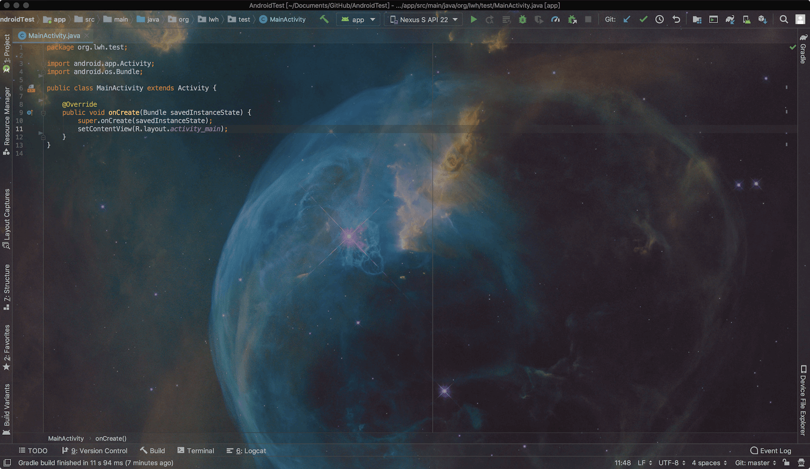

* [UI相关](#UI相关)
  * [为编辑器设置背景图片](#为编辑器设置背景图片)

### UI相关

#### 为编辑器设置背景图片

作为一枚安卓开发攻城狮，每天必不可少要用到 AndroidStudio，你是否厌倦了编辑器单调的单色背景，现在你可以为编辑器设置一张背景图了，步骤为：Preferences... → Appearance & Behavior → Appearance → UI Options → Background Image...

> 注意：较新版本的 AndroidStudio 才可以设置背景图，若版本较低，可以使用 AndroidStudio 插件 Sexy Editor 来设置背景图。

