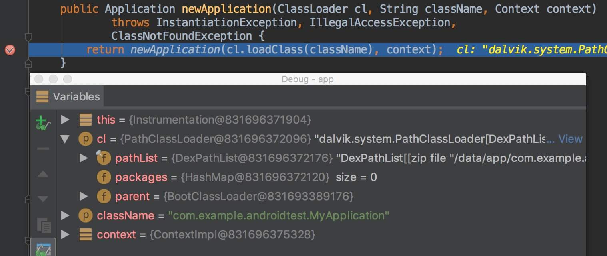
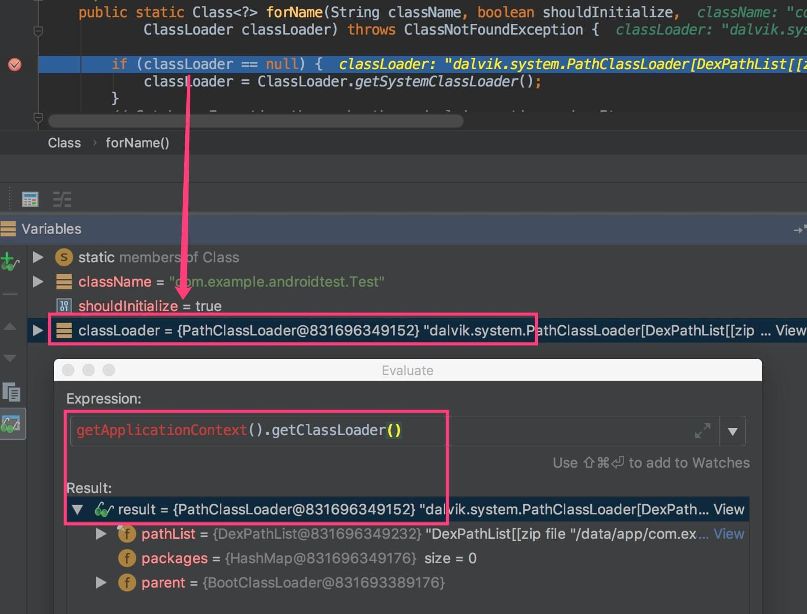

我们知道Java类是通过ClassLoader来加载的，在Android中framework层代码一般都是Java代码实现的，本文从应用的启动流程入手来了解ClassLoader，主要包括如下三部分：

- Application创建过程中ClassLoader的创建流程
- 加载四大组件的ClassLoader
- 加载自定义类的ClassLoader

从应用开发的角度来看，应用启动的第一步是`Application#onCreate`，因此我们从`Application#onCreate`入手进行分析。

## Application#onCreate

注：本文代码基于Android 6.0，下文中`aosp`表示Android源码根目录

继承`Application`创建`MyApplication`，并在AndroidManifest.xml将其设置为应用的Application，在其`onCreate()`方法中添加如下代码：

```java
new Throwable().printStackTrace();
```

启动应用，在logcat中看到输出如下堆栈：

```
W/System.err: java.lang.Throwable
W/System.err:     at com.example.androidtest.MyApplication.onCreate(MyApplication.java:9)
W/System.err:     at android.app.Instrumentation.callApplicationOnCreate(Instrumentation.java:1015)
W/System.err:     at android.app.ActivityThread.handleBindApplication(ActivityThread.java:4856)
W/System.err:     at android.app.ActivityThread.access$1600(ActivityThread.java:171)
W/System.err:     at android.app.ActivityThread$H.handleMessage(ActivityThread.java:1444)
W/System.err:     at android.os.Handler.dispatchMessage(Handler.java:102)
W/System.err:     at android.os.Looper.loop(Looper.java:150)
W/System.err:     at android.app.ActivityThread.main(ActivityThread.java:5684)
W/System.err:     at java.lang.reflect.Method.invoke(Native Method)
W/System.err:     at com.android.internal.os.ZygoteInit$MethodAndArgsCaller.run(ZygoteInit.java:799)
W/System.err:     at com.android.internal.os.ZygoteInit.main(ZygoteInit.java:689)
```

从堆栈中分析，Application对象的创建是从`ActivityThread.handleBindApplication`开始的，通过查看此函数实现，与Application创建相关的代码如下：

[aosp/frameworks/base/core/java/android/app/**ActivityThread.java**]

```java
private void handleBindApplication(AppBindData data) {
    ...
    data.info = getPackageInfoNoCheck(data.appInfo, data.compatInfo);
    ...
    // If the app is being launched for full backup or restore, bring it up in
    // a restricted environment with the base application class.
    Application app = data.info.makeApplication(data.restrictedBackupMode, null);
    mInitialApplication = app;
    ...
}
```

`data.info`是一个`LoadedApk`对象，通过调用`getPackageInfoNoCheck`得到的：

[aosp/frameworks/base/core/java/android/app/**ActivityThread.java**]

```java
final ArrayMap<String, WeakReference<LoadedApk>> mPackages
        = new ArrayMap<String, WeakReference<LoadedApk>>();

public final LoadedApk getPackageInfoNoCheck(ApplicationInfo ai,
                                             CompatibilityInfo compatInfo) {
    return getPackageInfo(ai, compatInfo, null, false, true, false);
}

private LoadedApk getPackageInfo(ApplicationInfo aInfo, CompatibilityInfo compatInfo,
                                 ClassLoader baseLoader, boolean securityViolation, boolean includeCode,
                                 boolean registerPackage) {
    final boolean differentUser = (UserHandle.myUserId() != UserHandle.getUserId(aInfo.uid));
    synchronized (mResourcesManager) {
        WeakReference<LoadedApk> ref;
        if (differentUser) {
            // Caching not supported across users
            ref = null;
        } else if (includeCode) { // 从getPackageInfoNoCheck函数中调用时传入的includeCode参数为true
            // 1.尝试从缓存中获取LoadedApk对象
            ref = mPackages.get(aInfo.packageName);
        } else {
            ref = mResourcePackages.get(aInfo.packageName);
        }

        // 2.因为是应用启动后首次调用，所以packageInfo为null
        LoadedApk packageInfo = ref != null ? ref.get() : null;
        if (packageInfo == null || (packageInfo.mResources != null
                && !packageInfo.mResources.getAssets().isUpToDate())) {
            if (localLOGV) Slog.v(TAG, (includeCode ? "Loading code package "
                    : "Loading resource-only package ") + aInfo.packageName
                    + " (in " + (mBoundApplication != null
                    ? mBoundApplication.processName : null)
                    + ")");
            // 3.直接通过new操作符创建LoadedApk对象
            // 注意：在getPackageInfoNoCheck中调用时传入的参数baseLoader为null，所以创建的LoadedApk对象中mBaseClassLoader对象为null（这个下文会用到）
            packageInfo =
                    new LoadedApk(this, aInfo, compatInfo, baseLoader,
                            securityViolation, includeCode &&
                            (aInfo.flags&ApplicationInfo.FLAG_HAS_CODE) != 0, registerPackage);

            if (mSystemThread && "android".equals(aInfo.packageName)) {
                packageInfo.installSystemApplicationInfo(aInfo,
                        getSystemContext().mPackageInfo.getClassLoader());
            }

            if (differentUser) {
                // Caching not supported across users
            } else if (includeCode) {
                // 4.将新创建的LoadedApk对象packageInfo添加到缓存中
                mPackages.put(aInfo.packageName,
                        new WeakReference<LoadedApk>(packageInfo));
            } else {
                mResourcePackages.put(aInfo.packageName,
                        new WeakReference<LoadedApk>(packageInfo));
            }
        }
        return packageInfo;
    }
}
```

当`data.info`创建完成后将执行`data.info.makeApplication`创建Application对象：

[aosp/frameworks/base/core/java/android/app/**LoadedApk.java**]

```java
public Application makeApplication(boolean forceDefaultAppClass,
                                   Instrumentation instrumentation) {
    ...
    // 调用getClassLoader()函数获得ClassLoader对象cl
    java.lang.ClassLoader cl = getClassLoader();
    if (!mPackageName.equals("android")) {
        initializeJavaContextClassLoader();
    }
    ContextImpl appContext = ContextImpl.createAppContext(mActivityThread, this);
    // 使用上文创建的cl对象创建Application对象
    app = mActivityThread.mInstrumentation.newApplication(
            cl, appClass, appContext);
    ...
    return app;
}
```

从`LoadedApk#makeApplication`函数实现中看到，首先调用`LoadedApk#getClassLoader `创建一个ClassLoader对象`cl`，然后使用`cl`创建Application对象。那么`cl`具体的创建流程和实际类型是什么呢？

[aosp/frameworks/base/core/java/android/app/**LoadedApk.java**]

```java
public ClassLoader getClassLoader() {
    synchronized (this) {
        // 当Application创建后首次执行到此处时mClassLoader为null
        if (mClassLoader != null) {
            return mClassLoader;
        }
        // 从上述代码分析中可知mIncludeCode为true，且普通应用的包名不是"android"，所以会执行到此if分支中
        if (mIncludeCode && !mPackageName.equals("android")) {
            ...
            mClassLoader = ApplicationLoaders.getDefault().getClassLoader(zip, lib,
                    mBaseClassLoader);
            ...
        } else {
            ...
        }
        return mClassLoader;
    }
}
```

可看到是通过调用`ApplicationLoaders#getClassLoader`得到的对象`cl`：

[aosp/frameworks/base/core/java/android/app/**ApplicationLoaders.java**]

```java
public ClassLoader getClassLoader(String zip, String libPath, ClassLoader parent)
{
    ClassLoader baseParent = ClassLoader.getSystemClassLoader().getParent();
    synchronized (mLoaders) {
        // 从上文创建LoadedApk对象代码可mBaseClassLoader为null，所以调用此函数时传入的parent参数为null，所以下面将执行“parent == baseParent”分支
        if (parent == null) {
            parent = baseParent;
        }
        if (parent == baseParent) {
            ...
            // 通过new操作符创建PathClassLoader对象pathClassloader
            PathClassLoader pathClassloader =
                    new PathClassLoader(zip, libPath, parent);
            ...
            return pathClassloader;
        }
        ...
    }
}
```

在此函数中`baseParent`是一个`BootClassLoader`对象，相关代码如下：

[aosp/libcore/libart/src/main/java/java/lang/**ClassLoader.java**]

```java
public static ClassLoader getSystemClassLoader() {
    return SystemClassLoader.loader;
}

static private class SystemClassLoader {
    public static ClassLoader loader = ClassLoader.createSystemClassLoader();
}

private static ClassLoader createSystemClassLoader() {
    String classPath = System.getProperty("java.class.path", ".");
    return new PathClassLoader(classPath, BootClassLoader.getInstance());
}
```

从上述`ApplicationLoaders#getClassLoader`代码中添加的注释可知`LoadedApk#getClassLoader `是一个`PathClassLoader`。在`LoadedApk#makeApplication `中已经拿到了`PathClassLoader`对象`cl`，接下来将执行`mActivityThread.mInstrumentation.newApplication(cl, appClass, appContext)`创建Application对象，相关代码如下：

[aosp/frameworks/base/core/java/android/app/**Instrumentation.java**]

```java
public Application newApplication(ClassLoader cl, String className, Context context)
        throws InstantiationException, IllegalAccessException,
        ClassNotFoundException {
    return newApplication(cl.loadClass(className), context);
}

static public Application newApplication(Class<?> clazz, Context context)
        throws InstantiationException, IllegalAccessException,
        ClassNotFoundException {
    Application app = (Application)clazz.newInstance();
    app.attach(context);
    return app;
}
```

从代码中看到在`Instrumentation#newApplication `使用了上文创建的`PathClassLoader`对象`cl`来加载`MyApplication `类。



至此，加载Application的ClassLoader已明确，就是PathClassLoader。

## 加载四大组件的ClassLoader

四大组件的创建，最后都会执行到`ActivityThread`中，分别通过`performLaunchActivity`、`handleCreateService`、`handleReceiver`、`installProvider`几个方法来启动的，具体代码如下：

```java
private Activity performLaunchActivity(ActivityClientRecord r, Intent customIntent) {
    ...
    java.lang.ClassLoader cl = r.packageInfo.getClassLoader();
    activity = mInstrumentation.newActivity(
            cl, component.getClassName(), r.intent);
    ...
}

private void handleCreateService(CreateServiceData data) {
    ...
    java.lang.ClassLoader cl = packageInfo.getClassLoader();
    service = (Service) cl.loadClass(data.info.name).newInstance();
    ...
}

private void handleReceiver(ReceiverData data) {
    ...
    java.lang.ClassLoader cl = packageInfo.getClassLoader();
    receiver = (BroadcastReceiver)cl.loadClass(component).newInstance();
    ...
}

private IActivityManager.ContentProviderHolder installProvider(Context context,
                                                               IActivityManager.ContentProviderHolder holder, ProviderInfo info,
                                                               boolean noisy, boolean noReleaseNeeded, boolean stable) {
    ...
    c = mInitialApplication;
    final java.lang.ClassLoader cl = c.getClassLoader();
    localProvider = (ContentProvider)cl.
            loadClass(info.name).newInstance();
    ...
}
```

从上述代码可看出，这几个方法最终都会通过`LoadedApk#getClassLoader`来加载相应的类，而这里的LoadedApk对象则是在上文中handleBindApplication流程期间创建并保存到ActivityThread的mPackages对象中的缓存，由此可得出加载四大组件的ClassLoader与加载Application的ClassLoader是同一个`PathClassLoader`。

## 加载普通类的ClassLoader

通过上文描述，我们已经明确了加载Application和四大组件的ClassLoader，那么在Android应用中，客户端自己编写的类是通过哪个ClassLoader加载的呢？

在测试应用中加入如下代码：

```java
Class.forName("com.example.androidtest.Test");
```

查看`Class`源码，内容如下：

[aosp/libcore/libart/src/main/java/java/lang/**Class.java**]

```java
public static Class<?> forName(String className) throws ClassNotFoundException {
    return forName(className, true, VMStack.getCallingClassLoader());
}
```

可看到使用了`VMStack.getCallingClassLoader()`加载普通类，其实现如下：

[aosp/libcore/libart/src/main/java/dalvik/system/**VMStack.java**]

```java
public final class VMStack {
    /**
     * Returns the defining class loader of the caller's caller.
     *
     * @return the requested class loader, or {@code null} if this is the
     * bootstrap class loader.
     */
    native public static ClassLoader getCallingClassLoader();
}
```

[aosp/art/runtime/native/**dalvik_system_VMStack.cc**]

```C++
// Returns the defining class loader of the caller's caller.
static jobject VMStack_getCallingClassLoader(JNIEnv* env, jclass) {
    ScopedFastNativeObjectAccess soa(env);
    NthCallerVisitor visitor(soa.Self(), 2);
    visitor.WalkStack();
    if (UNLIKELY(visitor.caller == nullptr)) {
        // The caller is an attached native thread.
        return nullptr;
    }
    return soa.AddLocalReference<jobject>(visitor.caller->GetDeclaringClass()->GetClassLoader());
}
```

从`VMStack.getCallingClassLoader()`注释中即可知道，普通类的加载是通过调用该类的caller类的类加载器来完成的，由上文分析知道，应用的类加载器是PathClassLoader，所以加载普通类的ClassLoader也是PathClassLoader。

以debug模式运行应用，可看到此结论是正确的，如图：



至此，我们已经完全弄清楚了Android应用中各个类是通过什么ClassLoader加载的。
