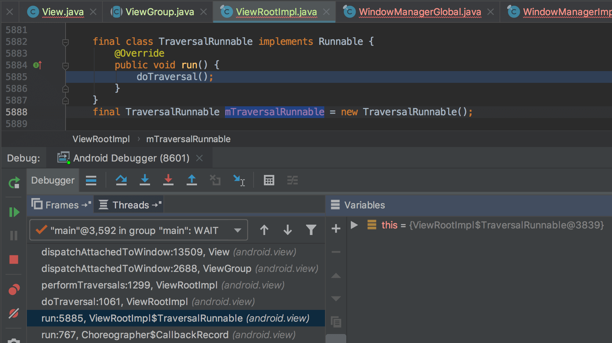
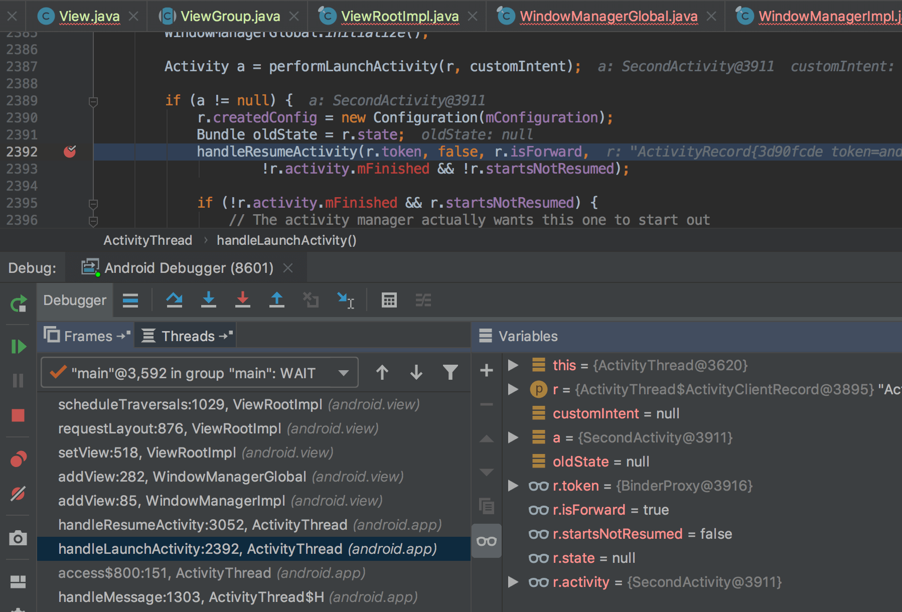
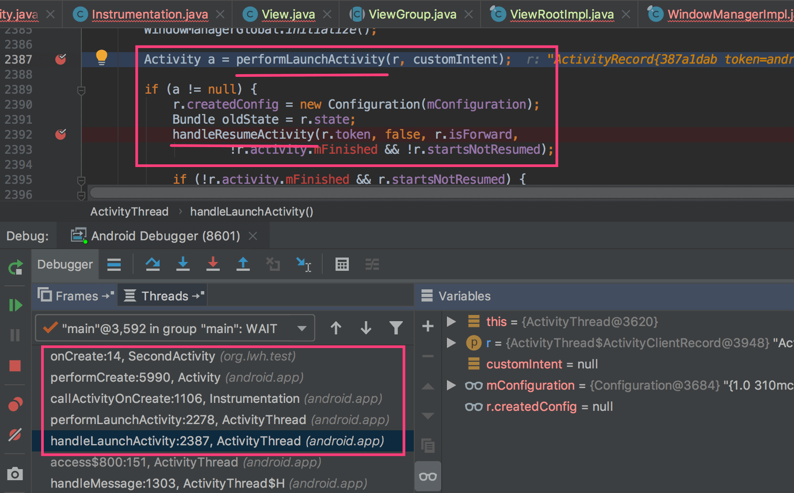

Activity 启动后，假如我们在 `onCreate` 中去获取 View 宽高，发现得到的结果为0。那么何时能正确获取到 View 的宽高呢？在网上搜索之后，看到一种解决方案为在 `onCreate` 中使用 `View#post` 的方式去获取，经过简单的验证，发现确实能正确获取到 View 的宽高，那么这里的原理是什么呢？一些说法认为这里利用了一个时间差，当 post 之后会有短暂的时间间隔，然后就能获取到 View 的宽高了，还有些做法甚至延迟一段时间来确保拿到正确的值，那么使用 `View#post` 方式去获取 View 宽高的做法是可靠的吗？本文将从源码的角度来进行分析。

对系统源码调试不熟悉的同学，请参考 [安卓源码调试指南](./安卓源码调试指南.md)。

若需要自己动手调试，建议 clone 我的安卓测试工程 [AndroidTest](https://github.com/deepen099/AndroidTest)，工程中包含了本文调试中用到的相关材料，便于自己动手调试验证。

> 说明：`AndroidTest` 工程是基于 Android 5.1 源码的，如果使用其他版本安卓源码调试，代码会有所不同。

下面将结合源码分析整个流程。

SecondActivity 中有一个 `Button`，在 onCreate 中执行了 `View#post` ，代码如下:

> SecondActivity.java

```java
package org.lwh.test;

import android.app.Activity;
import android.os.Bundle;
import android.util.Log;
import android.widget.Button;

public class SecondActivity extends Activity {

    private Button mBtn;

    @Override
    public void onCreate(Bundle savedInstanceState) {
        super.onCreate(savedInstanceState);
        setContentView(R.layout.activity_second);

        mBtn = findViewById(R.id.btn_second_activity);
        mBtn.post(new Runnable() {
            @Override
            public void run() {
                Log.e("zzz", "SecondActivity=" + mBtn.getWidth());
            }
        });
    }
}
```

查看 `View#post` 的源码，实现如下：

```java
public boolean post(Runnable action) {
    final AttachInfo attachInfo = mAttachInfo;
    if (attachInfo != null) {
        return attachInfo.mHandler.post(action);
    }
    // Assume that post will succeed later
    ViewRootImpl.getRunQueue().post(action);
    return true;
}
```

可看到当 View 调用 `post` 时根据 `attachInfo` 是否为 `null` 会执行不同的路径，那么在 `onCreate` 中调用 `post` 时 `attachInfo` 是否为 `null` 呢？

开始调试一下，在 `if (attachInfo != null) {` 行处打上断点，运行工程，发现在 `onCreate` 中调用 `post` 时 `attachInfo` 为 `null` 。那么此时为何为 `null` 呢？搜索 `mAttachInfo` 的使用处，发现只有两处对其赋值，一处是 `View#dispatchAttachedToWindow` 对其赋了一个实际值，另一处是 `View#dispatchDetachedFromWindow` 将其值置 `null`。在这两处打上断点，观察执行流程。

当执行到 `View#dispatchAttachedToWindow` 时观察其调用栈，可看出是由 `ViewRootImpl#mTraversalRunnable` 调用执行的，如下图所示：



查看 `mTraversalRunnable` 的调用处，为 `ViewRootImpl#scheduleTraversals`，在此处打上断点，查看其调用栈，如下图所示：



可看到 `ViewRootImpl#scheduleTraversals` 是在 `ActivityThread#handleLaunchActivity` 方法实现中由 `handleResumeActivity` 调用的。

此时回到上面的问题，若 View 调用 `post` 时 `mAttachInfo` 要为 `null`，需要执行到 `onCreate` 时执行了 `View#dispatchDetachedFromWindow` 或者还未执行 `View#dispatchAttachedToWindow`，通过调试可知，当 Activity 启动时不会执行 `View#dispatchDetachedFromWindow` ，所以我们猜想执行到 `Activity#onCreate` 时还未执行 `View#dispatchAttachedToWindow`，在 `Activity#onCreate` 入口处打上断点观察其调用栈，如下图所示：



从图中可看出 `Activity#onCreate` 是在 `ActivityThread#handleLaunchActivity` 方法实现中由 `performLaunchActivity` 调用的。从图中还能看出先执行了 `performLaunchActivity`，然后执行了 `handleResumeActivity`，而结合上文可知，`mAttachInfo` 是在 `View#dispatchAttachedToWindow` 中赋值的，而 `View#dispatchAttachedToWindow` 是由 `handleResumeActivity` 调用的，所以 `Activity#onCreate` 的执行早于 `mAttachInfo` 的赋值，所以在 `Activity#onCreate` 中对 View 调用 `post` 时 `mAttachInfo` 为 `null`。

分析至此，我们知道在 `Activity#onCreate` 中调用 `View#post` 时将执行 `ViewRootImpl.getRunQueue().post(action);`，此处 `ViewRootImpl.getRunQueue()` 为 `ViewRootImpl$RunQueue`，其源码如下，可看到在其上执行 `post` 就是将 `action` 添加到 `mActions` 中， 而`action` 的执行在 `executeActions` 中。

```java
static final class RunQueue {
    void post(Runnable action) {
        postDelayed(action, 0);
    }

    void postDelayed(Runnable action, long delayMillis) {
        mActions.add(handlerAction);
    }

    void executeActions(Handler handler) {
        synchronized (mActions) {
            final ArrayList<HandlerAction> actions = mActions;
            final int count = actions.size();

            for (int i = 0; i < count; i++) {
                final HandlerAction handlerAction = actions.get(i);
                handler.postDelayed(handlerAction.action, handlerAction.delay);
            }

            actions.clear();
        }
    }

    private static class HandlerAction {
    }
}
```

查看 `executeActions` 的调用，发现是在 `ViewRootImpl#performTraversals` 中，相关源码如下：

> ViewRootImpl.java

```java
private void performTraversals() {
    ...
    getRunQueue().executeActions(mAttachInfo.mHandler);
    ...
    performMeasure(childWidthMeasureSpec, childHeightMeasureSpec);
    ...
    performLayout(lp, desiredWindowWidth, desiredWindowHeight);
    ...
}
```

可看到先执行了 `getRunQueue().executeActions()`，然后执行 `measure`、`layout` 等操作，因为 `executeActions()` 不是立即执行，而是将任务 post 到消息队列中，所以当任务真正执行时， `measure`、`layout` 等操作已完成，所以 View 的大小就能确定了。