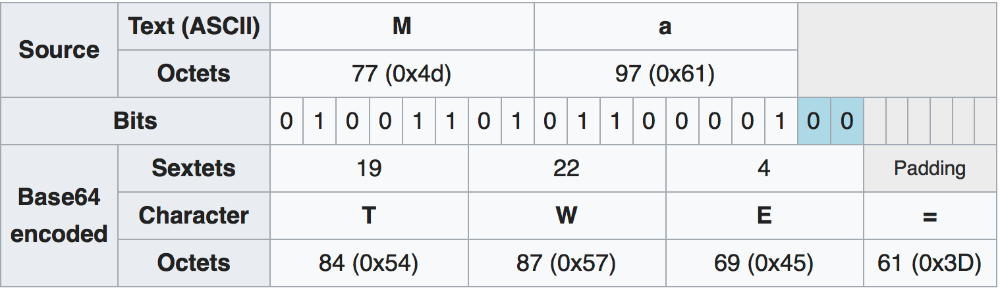

> 工作中经常使用 Base64 对 `byte[]` 进行编码，本文对其应用场景和编码原理进行简要介绍。

* [应用场景](#应用场景)
  * [服务端接口](#服务端接口)
  * [客户端请求](#客户端请求)
* [Base64索引表](#Base64索引表)
* [Base64原理](#Base64原理)
* [=有什么用](#=有什么用)

### 应用场景

本示例以 HTTP 请求携带二进制类型参数为例介绍 Base64 的一种应用场景。

#### 服务端接口

为了更方便的进行验证和调试，此处我们创建一个 Java Servlet 工程来提供接口。代码如下：

```java
import java.io.IOException;

import javax.servlet.ServletException;
import javax.servlet.annotation.WebServlet;
import javax.servlet.http.HttpServlet;
import javax.servlet.http.HttpServletRequest;
import javax.servlet.http.HttpServletResponse;

@WebServlet("/TestServlet")
public class TestServlet extends HttpServlet {
	private static final long serialVersionUID = 1L;

	public TestServlet() {
		super();
	}

	protected void doGet(HttpServletRequest request, HttpServletResponse response)
			throws ServletException, IOException {
		response.getWriter().append("42");
	}

	protected void doPost(HttpServletRequest request, HttpServletResponse response)
			throws ServletException, IOException {
		doGet(request, response);
	}
}
```

服务端代码编写完成后，以 debug 模式运行。获得接口地址为：http://10.129.33.84:8080/HttpTest/HelloServlet

> "10.129.33.84" 是我的电脑 IP 地址

#### 客户端请求

客户端使用 OkHttp 进行网络请求。假如我们想要传递两个参数 `a` 和 `b` 给接口，`a` 的值为 `1`，`b` 的值为 `byte[2, 3]`。客户端代码如下：

```kotlin
val builder = Request.Builder()
val bValue = byteArrayOf(2, 3)
builder.url("http://10.129.33.84:8080/HttpTest/HelloServlet?a=1&b=$bValue")
OkHttpClient().newCall(builder.build()).execute()
```

上述代码执行后，服务端返回了 `400`，告诉我们参数不合法。此时就需要用到 Base64 了。将 `bValue` 值使用 Base64 编码，然后再次发送请求，代码修改为：

```kotlin
val builder = Request.Builder()
val bValue = Base64.encodeToString(byteArrayOf(2, 3), Base64.DEFAULT)
builder.url("http://10.129.33.84:8080/HttpTest/HelloServlet?a=1&b=$bValue")
OkHttpClient().newCall(builder.build()).execute()
```

请求发送后，到服务端查看，发现收到了正确的数据，如下图所示：


### Base64索引表

下图为Base64索引表，下文将会用到。


### Base64原理

此处以 ASCII 文本 `Man` 为例说明 Base64 的编码原理。查看 ASCII 索引表，_`M`_, _`a`_ 和 _`n`_ 的索引值分别为 `77`, `97` 和 `110`，表示为8位二进制分别为 `01001101`, `01100001` 和 `01101110`，将这3个8位二进制值连接起来为 `010011010110000101101110`，将此值按照每 `6` 位进行分组，得到 `010011`, `010110`, `000101` 和 `101110`，换算为 10 进制后分别为：`19`, `22`, `5` 和 `46`，查询 `Base64索引表` 后分别对应的值为：`T`, `W`, `F` 和 `u`，所以 `Man` 使用 Base64 编码后的值为 `TWFu`，一个简易的对照表如下：


上面的 `Man` 字符串字节数为3，其8位二进制值正好是6位二进制值的倍数。如果少于3个字节，情形是怎样的呢？此时有两种情形：

情形一： `Ma`，编码后为 `TWE=`，对照表如下：



> 说明：当从前向后按照6位一组进行分组时，若后面的某 Base64 字符位数不足6位，则直接填充 `0`

情形二： `M`，编码后为 `TQ==`，对照表如下：


从上面的示例可以看出，Base64 字符表中的字符原本用6位就可以表示，现在按照每6位进行分组后，每个分组前面都要填充两个0（更直观的例子是 `Man` 编码后为 `TWFu`），所以编码后的字符串长度要比原文增加约三分之一。

### =有什么用

在上面的例子中 `M` 和 `Ma` 通过 Base64 编码后分别为 `TQ==` 和 `TWE=`，可以看到字符串的后面有 `=`，`=` 在这里起填充的作用，为了使编码块的最后包含4个 Base64 字符。`=` 一般可以省略，但是在多个 Base64 编码串连接时是必须的，否则就不能正确解析原始字符串了。

例如：

```kotlin
val withPadding = Base64.encodeToString(byteArrayOf('M'.toByte()), Base64.DEFAULT)
val noPadding = Base64.encodeToString(byteArrayOf('M'.toByte()), Base64.NO_PADDING)
```

其值分别为 `TQ==` 和 `TQ`。