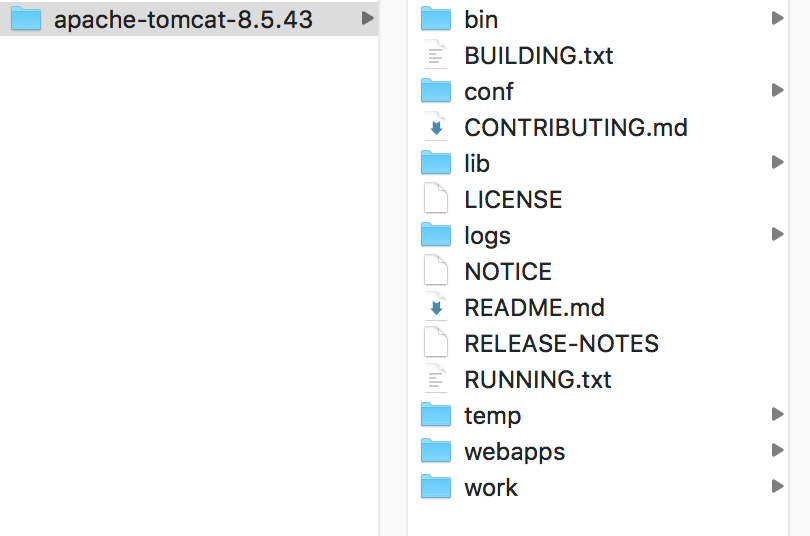
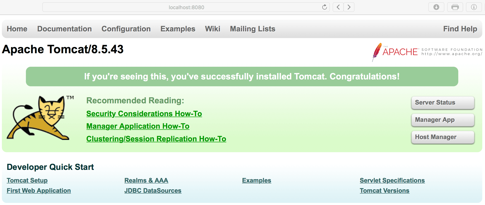
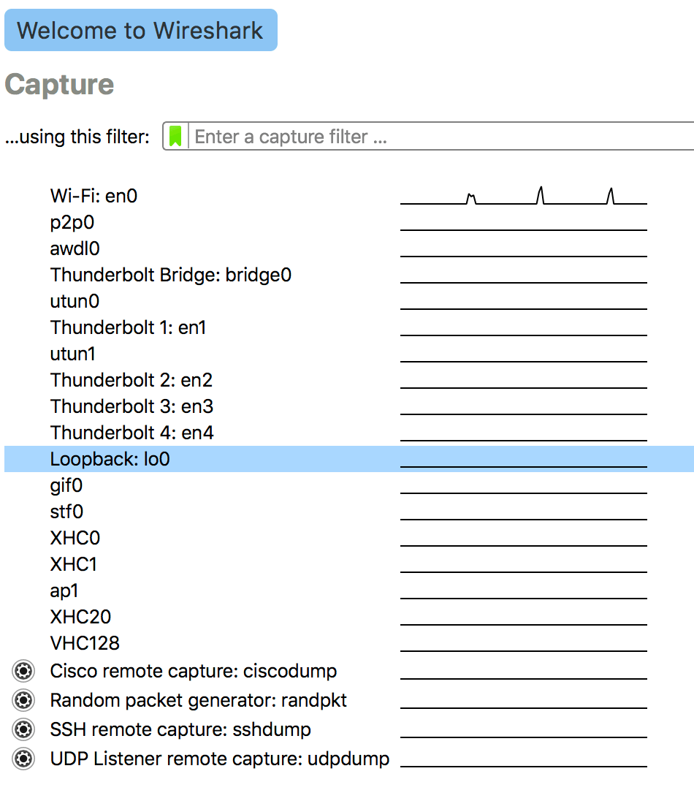
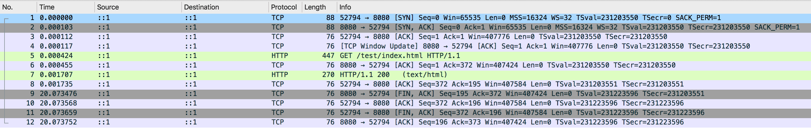

> 在日常工作中经常会用到 HTTP，也想要写一些相关的技术文章，但总是因为工作忙等各种原因搁置了，择日不如撞日，就从 HTTP 实验环境搭建开始吧。

Web 容器选择 Tomcat，抓包工具选择 Wireshark。

* [Tomcat配置](#Tomcat配置)
* [Wireshark抓包](#Wireshark抓包)

### Tomcat配置

1. 在 [http://tomcat.apache.org](http://tomcat.apache.org) 页面上下载 tomcat 安装包，下载完成后直接解压到磁盘上某个目录即可。例如我下载的压缩包解压后内容如下：



2. 设置 Tomcat 管理员用户名和密码

以步骤1中我下载的 Tomcat 为例，编辑“apache-tomcat-8.5.43/conf/tomcat-users.xml”文件，参考示例如下：

```
<?xml version="1.0" encoding="UTF-8"?>
<tomcat-users xmlns="http://tomcat.apache.org/xml"
              xmlns:xsi="http://www.w3.org/2001/XMLSchema-instance"
              xsi:schemaLocation="http://tomcat.apache.org/xml tomcat-users.xsd"
              version="1.0">
<role rolename="manager-gui"/>
<role rolename="manager-script"/>
<role rolename="manager-jmx"/>
<role rolename="manager-status"/>
<role rolename="admin-gui"/>
<role rolename="admin-script"/>
<user username="ponda" password="123456" roles="manager-gui,manager-script,manager-jmx,manager-status,admin-gui,admin-script"/>
</tomcat-users>
```

3. 启动 Tomcat

进入“apache-tomcat-8.5.43/bin/”目录，执行命令 `./startup.sh` 启动。

启动后在浏览器中访问 [http://localhost:8080](http://localhost:8080)，若 Tomcat 成功启动，将正确打开页面，如下图所示：



可点击图中的按钮如“Server Status”，使用步骤2中配置的 `username` 和 `password`登录即可查看服务器的状态信息。

4. 创建一个测试页面

进入“apache-tomcat-8.5.43/webapps/”目录，创建一个文件夹如“test”，然后在“test”文件夹中创建一个文件“index.html”，使用文本编辑器打开“index.html”，在其中写入内容 `1`。

使用浏览器访问 [http://localhost:8080/test/index.html](http://localhost:8080/test/index.html) 即可看到我们创建的网页。

至此，Tomcat 配置已基本完成，下面将结合抓包工具 Wireshark 查看一次完整的网络请求的过程。

### Wireshark抓包

1. 在 [https://www.wireshark.org](https://www.wireshark.org) 页面上下载 Wireshark 安装包，直接安装即可。

2. 启动 Wireshark，因为我们的实验环境运行在本机 `127.0.0.1` 上，也就是 loopback “环回”地址。所以，在 Wireshark 里要选择“Loopback: lo0”，如下图所示：



3. 使用浏览器访问 [http://localhost:8080/test/index.html](http://localhost:8080/test/index.html)，然后在 Wireshark 中即可看到网络请求详情，如TCP的三次握手和四次挥手，如下图所示：



上图网络包可在 [此处](./file/http_test_env_set/GetTestIndexHtml.pcapng) 下载，使用 Wireshark 打开即可。