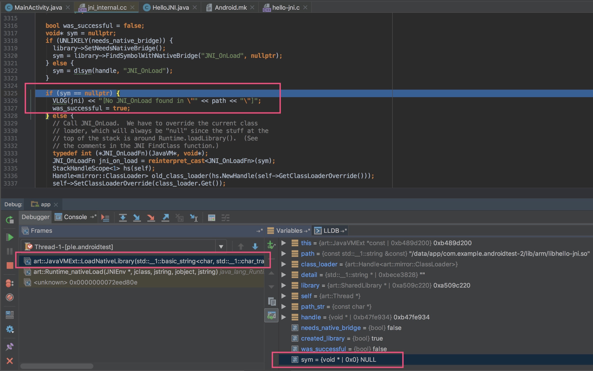
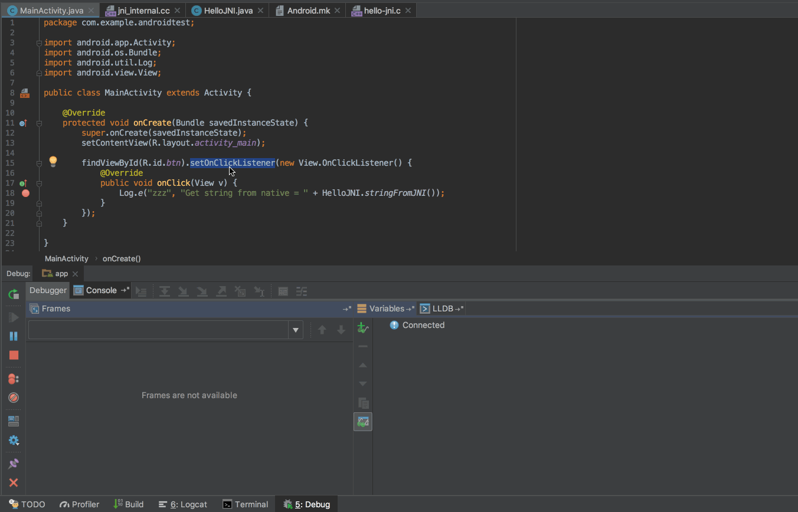

## JNI简介

JNI是Java Native Interface的缩写，中文翻译Java本地接口。JNI是Java语言中的技术，因为Android上层采用Java语言实现，所以也可以在Android中使用JNI。JNI主要是完成Java代码与native代码进行交互，即：在Java代码中调用native语言编写的代码或在native代码中调用Java编写的代码，一般情况下native语言指的是C/C++语言。在应用开发中，对于性能或者安全性较高的模块，都可以使用JNI技术实现。

在阅读Android源码时会发现使用了大量的JNI，所以想要顺利的阅读源码学习JNI是必不可少的。下面将结合一个Android应用实例来分析JNI。

## JNI在Android应用开发中的使用

说明：

- 本文示例使用[Android动态链接库的使用及加载过程分析](./Android动态链接库的使用及加载过程分析.md)文章中的“Android开发中一个简单的JNI示例”
- 因为使用Android6.0源码编译的包不能运行起来（原因暂时未知），所以本文使用：1.Android5.1源码编译的包；2.[ART](https://android.googlesource.com/platform/art/) 源码分支：`lollipop-mr1-release`）

在Java中使用`native`关键字来声明该方法为native方法，在Java层调用声明为native的方法最终会调用到native方法，在调用native方法前必须先调用`System.loadLibrary`加载一个动态链接库，如示例中的`System.loadLibrary("hello-jni");`。动态链接库的格式在Linux系统中一般为`so`，在Windows系统中为`dll`。例如执行`System.loadLibrary("hello-jni");`加载动态链接库，系统会根据不同的平台扩展为真实的动态库名称，如在Linux上会扩展为`libhello-jni.so`，在Android环境下，例如会查找`/data/app-lib/${package-name}/libhello-jni.so`，当找到此文件时会尝试加载，若找不到文件，会报无法链接的错误，`UnsatisfiedLinkError`，例如示例中不加入so库，然后编译运行执行native函数会报错：java.lang.UnsatisfiedLinkError: dalvik.system.PathClassLoader[DexPathList[[zip file "/data/app/com.example.androidtest-2/base.apk"],nativeLibraryDirectories=[/vendor/lib, /system/lib]]] couldn't find "libhello-jni.so"

那么在Java层调用声明为native的Java方法时是如何寻找到native方法的呢？

比如示例中的`HelloJNI`类：

```java
package com.example.androidtest;

public class HelloJNI {
    static {
        System.loadLibrary("hello-jni");
    }

    public static native String stringFromJNI();
}
```

如果调用`HelloJNI.stringFromJNI()`，最终会调用到`Java_com_example_androidtest_HelloJNI_stringFromJNI`：

```C
#include <string.h>
#include <jni.h>

JNIEXPORT jstring JNICALL
Java_com_example_androidtest_HelloJNI_stringFromJNI( JNIEnv* env,
                                                  jclass clazz )
{
    // 此处省略获取ABI变量的代码
    return (*env)->NewStringUTF(env, "Hello from JNI !  Compiled with ABI " ABI ".");
}
```

可以看出，native方法的寻找是有一定规则的，规则为：JNIEXPORT和JNICALL以及Java_ + 包名（点换成下划线）+ _ + 类名 + _ + 方法名的命名方式，当在Java中首次调用native方法时，虚拟机会在不主动调用注册方法的情况下建立起这个映射关系，称为静态注册。静态注册有一些弊端，比如方法名太长（如本例中的`Java_com_example_androidtest_HelloJNI_stringFromJNI`），建立映射关系时会影响运行效率等，为了解决这些问题，JNI还提供了动态注册。动态注册就是开发者手动参与native函数的注册过程，让使用JNI的native函数在so库加载完成后就执行注册，而不是等到调用时才进行注册，以提高调用效率，并且在动态注册中也不用遵守前面的命名规范了，可以给JNI函数取自己认为合适的名字。

下面是一个典型的动态注册过程，修改示例工程中的`hello-jni.c`内容如下：

```C
#include <string.h>
#include <jni.h>

static const char* kClass = "com/example/androidtest/HelloJNI";

static jstring stringFromJNI(JNIEnv *env, jclass type) {
    return (*env)->NewStringUTF(env, "Hello from JNI !");
}

static JNINativeMethod gMethods[] = {
        {
                "stringFromJNI",
                "()Ljava/lang/String;",
                (void*)stringFromJNI
        },
};

JNIEXPORT jint JNICALL
JNI_OnLoad(JavaVM* vm, void* reserved){
    JNIEnv *env = NULL;
    if ((*vm)->GetEnv(vm, (void **) &env, JNI_VERSION_1_4) != JNI_OK) {
        return JNI_FALSE;
    }
    jclass jclazz= (*env)->FindClass(env, kClass);
    if((*env) -> RegisterNatives(env, jclazz, gMethods, sizeof(gMethods)/ sizeof(gMethods[0])) < 0) {
        return JNI_FALSE;
    }
    return JNI_VERSION_1_4;
}
```

此时按照步骤7重新编译so库，然后重新运行示例，点击按钮，观察到logcat中输出`Hello from JNI !`，说明native函数调用成功了。

动态注册过程分析如下，当动态链接库加载后，虚拟机会首先调用`JNI_OnLoad`方法，所以我们在`JNI_OnLoad`方法做一些初始化工作，包括动态注册函数，此例中只动态注册了一个函数，即`stringFromJNI`。

`vm`指向一个`JavaVM`结构体，它是全局唯一的，代表着虚拟机的相关信息，通过它获取`env`，指向的是`JNIEnv`结构体，然后使用`env`获取需要注册的类，类名中的点改成”/”，然后调用`RegisterNatives`注册该类的native函数。

`gMethods`是一个`JNINativeMethod`数组，包含了此类中需要注册的函数。`JNINativeMethod`的定义如下：

[aosp/libnativehelper/include/nativehelper/jni.h]

```C
typedef struct {
    const char* name;
    const char* signature;
    void*       fnPtr;
} JNINativeMethod;
```

`name`是Java层的函数名，如`stringFromJNI`；`signature`是方法签名信息，如`()Ljava/lang/String;`，括号里面是参数，后面是返回值；`fnPtr`是函数指针。

这样就将Java层的函数与native函数关联起来了。

现在来简单描述一下JNI静态注册和动态注册的区别，静态注册会根据特定的规则去寻找native函数（如本例中的`Java_com_example_androidtest_HelloJNI_stringFromJNI`），动态注册需要开发者自己实现`JNI_OnLoad`方法并在此方法中手动注册native函数。

回顾[Android动态链接库的使用及加载过程分析](./Android动态链接库的使用及加载过程分析.md)中ClassLoader存在时动态库加载流程的最后一步`JavaVMExt::LoadNativeLibrary`：

[aosp/art/runtime/**jni_internal.cc**]

```C++
bool JavaVMExt::LoadNativeLibrary(JNIEnv* env, const std::string& path, jobject class_loader,
                                  std::string* error_msg) {
  ...
  void* sym;
  if (needs_native_bridge) {
    ...
  } else {
    // 2.获取方法地址
    sym = dlsym(handle, "JNI_OnLoad");
  }
  if (sym == nullptr) {
    // 'sym'为NULL时，开发者未实现"JNI_OnLoad"方法，so库加载成功
    was_successful = true;
  } else {
    ...
    typedef int (*JNI_OnLoadFn)(JavaVM*, void*);
    // 3.强制类型转换成函数指针
    JNI_OnLoadFn jni_on_load = reinterpret_cast<JNI_OnLoadFn>(sym);
    // 4.调用函数
    int version = (*jni_on_load)(this, nullptr);
    ...
}
```

可以看出，当开发者未实现`JNI_OnLoad`函数时，so库加载成功标志位直接被置为true，当开发者实现了`JNI_OnLoad`函数时，会执行`JNI_OnLoad`函数。

下面以debug模式运行测试应用来验证上述说法。

- 未实现`JNI_OnLoad`函数



从图中看到未实现`JNI_OnLoad`函数时`sym`为`NULL`

- 实现了`JNI_OnLoad`函数

`JNI_OnLoad`函数调用调试视频



## 在native层调用Java方法

在示例工程中创建`HelloJNI2.java`

[HelloJNI2.java]

```java
package com.example.androidtest;

public class HelloJNI2 {
    public String stringFromJava() {
        return "Hello from Java!";
    }
}
```

修改`hello-jni.c`文件内容，在其中调用Java方法：

[hello-jni.c]

```C
#include <string.h>
#include <jni.h>

JNIEXPORT jstring JNICALL
Java_com_example_androidtest_HelloJNI_stringFromJNI( JNIEnv* env,
                                                  jclass clazz )
{
   jclass jClazz = (*env)->FindClass(env, "com/example/androidtest/HelloJNI2");
   if (jClazz == NULL) {
       return NULL;
   }
   jmethodID constructor = (*env)->GetMethodID(env, jClazz, "<init>", "()V");
   if (constructor == NULL) {
       return NULL;
   }
   jobject jObject = (*env)->NewObject(env, jClazz, constructor);
   if (jObject == NULL) {
       return NULL;
   }
   jmethodID stringFromJava = (*env)->GetMethodID(env, jClazz, "stringFromJava", "()Ljava/lang/String;");
   if (stringFromJava == NULL) {
       (*env)->DeleteLocalRef(env, jClazz);
       (*env)->DeleteLocalRef(env, jObject);
       return NULL;
   }
   jstring resultStr = (*env)->CallObjectMethod(env, jObject, stringFromJava);
   (*env)->DeleteLocalRef(env, jClazz);
   (*env)->DeleteLocalRef(env, jObject);
   return resultStr;
}
```

重新编译工程，调用`HelloJNI.stringFromJNI()`即可得到`HelloJNI2#stringFromJava`函数返回的值。

## 参考

[理解 JNI 技术](https://pqpo.me/2017/05/17/jni/)

[Android JNI原理分析](http://gityuan.com/2016/05/28/android-jni/)

[从源码角度看JNI](http://navyblue.top/2018/07/29/从源码角度看JNI/)
