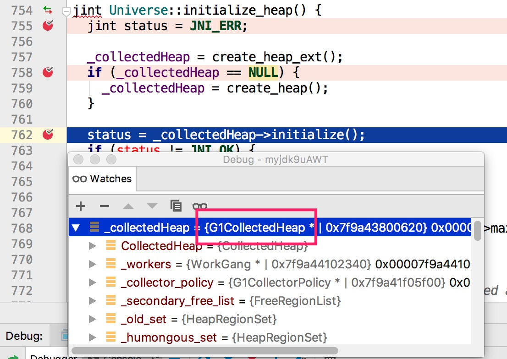

本文从JVM源码角度分析System.gc()相关内容。

- 操作系统：macOS 10.13.6
- JDK版本：OpenJDK9u

注：下文中`jvm`表示OpenJDK源码根目录

## System.gc()

> jvm/jdk/src/java.base/share/classes/java/lang/System.java

```java
public static void gc() {
    Runtime.getRuntime().gc();
}
```

`Runtime.getRuntime()`获取了一个`Runtime`单例，然后执行native的`gc()`方法：

> jvm/jdk/src/java.base/share/classes/java/lang/Runtime.java

```java
private static final Runtime currentRuntime = new Runtime();

public static Runtime getRuntime() {
    return currentRuntime;
}

public native void gc();
```

## gc()

> jvm/jdk/src/java.base/share/native/libjava/Runtime.c

```C
JNIEXPORT void JNICALL
Java_java_lang_Runtime_gc(JNIEnv *env, jobject this)
{
    JVM_GC();
}
```

## JVM_GC

> jvm/hotspot/src/share/vm/prims/jvm.cpp

```C++
JVM_ENTRY_NO_ENV(void, JVM_GC(void))
  if (!DisableExplicitGC) {
    Universe::heap()->collect(GCCause::_java_lang_system_gc);
  }
JVM_END
```

在`JVM_GC`函数中有一个`DisableExplicitGC`变量，默认为`false`，如果启动JVM时设置了参数`-XX:+DisableExplicitGC`则此变量为true。

`Universe::heap()`返回当前的堆对象，然后在此堆对象上调用`collect`方法执行内存回收，内存回收的原因为`_java_lang_system_gc`。

JVM堆的具体实现是由`Universe::initialize_heap`决定的。

## Universe::initialize_heap

> jvm/hotspot/src/share/vm/memory/universe.cpp

```C++
jint Universe::initialize_heap() {
  _collectedHeap = create_heap_ext();
  if (_collectedHeap == NULL) {
    // 创建堆
    _collectedHeap = create_heap();
  }
  // 初始化堆，如设置堆的大小
  status = _collectedHeap->initialize();
}

CollectedHeap* Universe::create_heap() {
  // 根据传入参数创建相应类型的堆
  if (UseParallelGC) {
    return Universe::create_heap_with_policy<ParallelScavengeHeap, GenerationSizer>();
  } else if (UseG1GC) {
    return Universe::create_heap_with_policy<G1CollectedHeap, G1CollectorPolicy>();
  } else if (UseConcMarkSweepGC) {
    return Universe::create_heap_with_policy<GenCollectedHeap, ConcurrentMarkSweepPolicy>();
  } else if (UseSerialGC) {
    return Universe::create_heap_with_policy<GenCollectedHeap, MarkSweepPolicy>();
  }
}
```

在`Universe::create_heap`实现中会根据设置的GC类型创建对应的堆，在OpenJDK9u中默认为`G1CollectedHeap`，如图：



## heap()->collect

成功获取到堆对象后，调用`collect`方法执行内存回收，因为默认是`G1CollectedHeap`，将执行`g1CollectedHeap.cpp`中的`collect`方法

> jvm/hotspot/src/share/vm/gc/g1/g1CollectedHeap.cpp

```C++
void G1CollectedHeap::collect(GCCause::Cause cause) {
  ...
}
```

至此，gc调用流程结束。

若想要使用其他类型的GC，在启动JVM时，可以添加参数，如`-XX:+UseParallelGC`将使用`ParallelScavengeHeap`。
