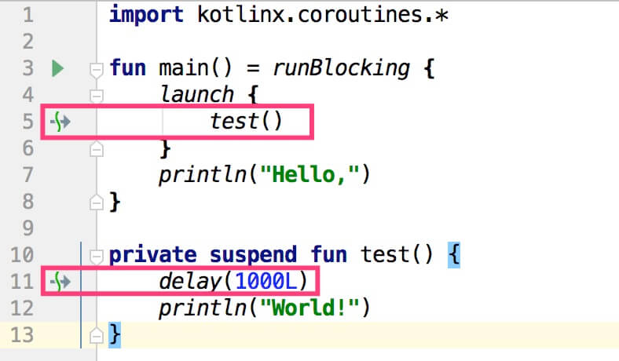

本文简要介绍了Kotlin协程基础知识。

* [什么是协程](#什么是协程)
* [协程使用示例](#协程使用示例)
  * [示例代码分析](#示例代码分析)
* [协程基础](#协程基础)
  * [初识协程使用](#初识协程使用)
  * [协程区分](#协程区分)
  * [等待协程完成](#等待协程完成)
  * [结构化的并发](#结构化的并发)
  * [作用域构造器](#作用域构造器)
  * [挂起函数](#挂起函数)
  * [协程是轻量级的](#协程是轻量级的)
* [协程的取消和超时](#协程的取消和超时)
  * [取消协程](#取消协程)
  * [取消是协作的](#取消是协作的)
  * [使计算代码可取消](#使计算代码可取消)
  * [在finally中关闭资源](#在finally中关闭资源)
  * [在finally中使函数不可取消](#在finally中使函数不可取消)
  * [超时](#超时)
* [组合挂起函数](#组合挂起函数)
  * [顺序调用](#顺序调用)
  * [使用 async 并发](#使用-async-并发)
  * [懒启动的async](#懒启动的async)
  * [使用 async 的结构化并发](#使用-async-的结构化并发)
* [协程上下文与调度器](#协程上下文与调度器)
  * [调度器与线程](#调度器与线程)
  * [非受限调度器 vs 受限调度器](#非受限调度器-vs-受限调度器)
  * [线程切换](#线程切换)
  * [上下文中的任务](#上下文中的任务)
  * [子协程](#子协程)
  * [父协程的职责](#父协程的职责)
  * [命名协程以用于调试](#命名协程以用于调试)
  * [组合上下文中的元素](#组合上下文中的元素)
  * [通过显式任务取消](#通过显式任务取消)
  * [线程局部数据](#线程局部数据)
* [异常处理](#异常处理)
  * [异常的传播](#异常的传播)
  * [CoroutineExceptionHandler](#CoroutineExceptionHandler)
  * [取消与异常](#取消与异常)
  * [异常聚合](#异常聚合)
* [监督(Supervision)](#监督)
  * [监督任务(Supervision job)](#监督任务)
  * [监督作用域(Supervision scope)](#监督作用域)
  * [监督协程中的异常](#监督协程中的异常)
* [共享可变状态和并发](#共享可变状态和并发)
  * [并发问题](#并发问题)
  * [volatile不起作用](#volatile不起作用)
  * [线程安全的数据结构](#线程安全的数据结构)
  * [以细粒度限制线程](#以细粒度限制线程)
  * [以粗粒度限制线程](#以粗粒度限制线程)
  * [互斥](#互斥)
* [Android UI编程](#Android-UI编程)

## 什么是协程

协程可以理解为用户态线程，它和线程一样可以执行异步任务，和线程区别在于线程是由操作系统创建和调度的，而协程可以简单理解为由应用程序自己创建和调度（在Kotlin中是由协程库实现的），这样在执行异步任务时不会触发操作系统的线程创建，能够节约资源。另一个主要的优点是异步编程，它能够简化异步代码的编写，使原来需要使用回调等方式书写的代码，可以用看似同步的方式书写。

关于简化代码的编写，考虑如下场景，我们在`线程#1`中执行一些操作后生成结果`a`，然后结果`a`将在`线程#2`中使用生成结果`b`，最后结果`a`和`b`将在`线程#3`中使用，按照通常的写法，代码大致如下：

```
import kotlin.concurrent.thread

fun main() {
    thread { // #1
        // 执行一些操作
        val a = 1
        thread { // #2
            // 执行一些操作
            val b = a + 1
            thread { // #3
                println("a+b=" + (a + b))
            }
        }
    }
}
```

输出：

```
a+b=3
```

如果采用协程，代码就可以使用如下方式书写：

```
import kotlinx.coroutines.GlobalScope
import kotlinx.coroutines.async
import kotlinx.coroutines.runBlocking

fun main() = runBlocking {
    val a = GlobalScope.async {
        1
    }
    val b = GlobalScope.async {
        a.await() + 1
    }
    println("a+b="+(a.await()+b.await()))
}
```

运行后将得到与上面一段代码相同的结果，但是代码看起来更加清晰，用看似同步的方式实现了需要嵌套回调等方式才能解决的问题。

## 协程使用示例

1. 使用IntelliJ IDEA创建Kotlin工程

> 注意：协程在Kotlin1.3中才发布正式版本，所以新创建的Kotlin工程要使用Kotlin1.3。Kotlin升级方法为：Preference->Lanugage & Framework->Kotlin Updates

2. 添加协程库

因为Kotlin协程不随Kotlin标准库一起发布，所以需要在工程中单独添加协程库支持。在IntelliJ中参考配置方法如下：

File -> Project Structure... -> Modules - > Dependencies，按“+”按钮，然后依次选择Library -> From Maven...，在弹窗中输入：org.jetbrains.kotlinx:kotlinx-coroutines-core:1.3.20，记得勾选"Transitive dependencies" 和 "Sources"

3. 创建Test.kt文件，添加如下代码：

```Kotlin
import kotlinx.coroutines.*

fun main() {
    GlobalScope.launch {
        delay(500)
        println("1:"+Thread.currentThread().name)
    }
    println("2:"+Thread.currentThread().name)
    Thread.sleep(1000)
}
```

运行代码，输出如下：

```
2:main
1:DefaultDispatcher-worker-1
```

### 示例代码分析

* 为了使用协程库，需要导入协程库包`import kotlinx.coroutines.*`
* 从Kotlin1.3开始`main()`函数的参数`args : Array<String>`不是必选项了
* 协程要在协程作用域（`CoroutineScope`）中启动和运行，`GlobalScope`是协程库中定义的一个协程作用域，它是应用全局的，对于`全局`可以这样理解，就像Java工程中通过`new Thread().start();`创建一个线程，这个线程是应用全局的，它不与任何任务绑定，当通过`GlobalScope`启动一个协程后，这个协程就会在后台执行，执行完成后自动退出
* `launch`是协程构建器（`coroutine builder`），通过它来创建运行协程，就像Java中通过`new Thread().start();`创建并运行线程一样，所以`GlobalScope.launch`表示在`GlobalScope`协程作用域中启动一个协程，也就是在应用全局启动一个协程
* `delay(500)`表示挂起协程500毫秒，`delay`是一个特殊的函数，称为挂起函数（suspending function），它不会阻塞线程，但是会挂起协程，并且挂起函数只能在协程中使用。在这里的作用就是挂起协程500毫秒后，打印出执行当前协程的线程名称。
* `Thread.sleep(1000)`让`main`线程睡眠1000毫秒，它的作用是阻塞主线程1秒以保持Java虚拟机（JVM）存活。为什么需要阻塞主线程以保持JVM存活呢？后面会讲到，这里简单阐述一下，因为协程的生命周期类似于守护线程，若主线程退出，它也会退出，造成任务中断执行。简单的验证方法为将`Thread.sleep(1000)`删除，发现输出变为：`2:main`。这也是协程和线程的一个区别，线程默认是非守护的。例如：

```
import kotlin.concurrent.thread

fun main() {
    thread {
        Thread.sleep(1000)
        println("1:"+Thread.currentThread().name)
    }
    println("2:"+Thread.currentThread().name)
}
```

运行后输出：

```
2:main
1:Thread-0
```

可以看到JVM会等待`Thread-0`线程执行完成后才退出。

## 协程基础

### 初识协程使用

上述示例中使用了`Thread.sleep`的方式来阻塞JVM不退出，那么如何使用协程的方式达到同样的效果呢？

```
import kotlinx.coroutines.*

fun main() {
    GlobalScope.launch {
        delay(1000L)
        println("1:" + Thread.currentThread().name)
    }
    println("2:" + Thread.currentThread().name)
    runBlocking {
        delay(2000L)
        println("3:" + Thread.currentThread().name)
    }
    println("4:" + Thread.currentThread().name)
}
```

输出：

```
2:main
1:DefaultDispatcher-worker-1
3:main
4:main
```

`runBlocking`的作用是在当前线程中启动一个新的协程，并且此协程一直阻塞当前线程直到此协程执行完成为止，在此处就是阻塞了`main`线程的执行，直到`runBlocking`代码块中的任务执行完成后才继续`main`线程的执行，此处是执行`println("4:" + Thread.currentThread().name)`

本示例更惯常（idiomatic）的写法为：

```
import kotlinx.coroutines.*

fun main() = runBlocking<Unit> {
    GlobalScope.launch {
        delay(1000L)
        println("1:"+Thread.currentThread().name)
    }
    println("2:"+Thread.currentThread().name)
    delay(2000L)
    println("3:"+Thread.currentThread().name)
}
```

输出：

```
2:main @coroutine#1
1:DefaultDispatcher-worker-1 @coroutine#2
3:main @coroutine#1
```

这样`main()`函数就被改造成了一个协程，就可以在其中执行`delay(2000L)`了（回顾上文，`delay`函数只能在协程中执行）。`runBlocking`后面带`<Unit>`的原因是`main()`函数的返回值为`Unit`，但是`<Unit>`可以省略。

### 协程区分

参考如下代码：

```
import kotlinx.coroutines.*

fun main() = runBlocking {
    launch {
        delay(1000)
        println("1:" + Thread.currentThread().name)
    }
    println("2:" + Thread.currentThread().name)
}
```

运行后输出：

```
2:main
1:main
```

为什么打印结果是这样的，还可以直接使用`launch`了呢？下面将一一解释。

从上节中了解到对`main()`函数执行了`runBlocking`后，就由系统创建了一个新的协程，而协程必须运行在协程作用域中，所以`main()`函数中自动具有了协程作用域，前面章节中使用`GlobalScope.launch`是在`GlobalScope`协程作用域中启动协程的，此处`main()`函数中已经具有了协程作用域，所以可以在`main()`中直接调用`launch`。

同样由前面章节知道，调用`launch`后会创建一个新的协程，从输出中可以看出，由`runBlocking`启动的协程和由`launch`启动的协程都是在`main`线程中执行的，那么我们该如何区分这两个协程呢？

可以通过在运行代码时添加虚拟机参数`-Dkotlinx.coroutines.debug`来实现，添加此参数后运行，输出如下：

```
2:main @coroutine#1
1:main @coroutine#2
```

可以看出本例中的两个协程都是在`main`线程中执行，但是`runBlocking`启动的协程是`@coroutine#1`，`launch`启动的协程是`@coroutine#2`。这也能解释上面所说的为什么将协程称之为用户态线程，例如本例中两个协程都是在同一个线程（即：`main`线程）中执行，但是它们却实现了异步的效果。

> 在安卓中如何调试协程呢？可以在`Application#onCreate`中执行`System.setProperty("kotlinx.coroutines.debug", "on");`，启动协程时为其添加名称即可。

### 等待协程完成

在“初识协程使用”小节中，我们知道在`GlobalScope`协程作用域中启动的协程的生命周期类似于守护线程的生命周期，所以我们需要阻塞主线程一段时间等待它任务执行完成。那么是否有更好的等待方法呢？答案是肯定的，使用`launch`创建协程时将返回一个`Job`对象，`Job`中有`join()`函数来完成等待。

此处引入另一个新术语`async`，`async`和`launch`作用类似，只不过`launch`没有返回值，而`async`可以返回一个值。

例如：

```
import kotlinx.coroutines.*

fun main() = runBlocking {
    val job1: Job = GlobalScope.launch {
        delay(1000)
        println("job1")
    }
    val job2: Deferred<Int> = GlobalScope.async {
        delay(2000)
        println("job2")
        1
    }
    job1.join()
    println(job2.await())
}
```

输出：

```
job1
job2
1
```

在`runBlocking`中调用`job1.join()`和`job2.await()`等待`job1`和`job2`完成，`job2.await()`还会返回一个值。

从Kotlin源码中可知，`Deferred`继承自`Job`：

```
public interface Deferred<out T> : Job {}
```

而`Job`类似于Java中的线程，有新建，活跃、完成、取消等状态，所以印证了上文描述的协程可以称为用户态线程的说法。

```
                                     wait children
+-----+ start  +--------+ complete   +-------------+  finish  +-----------+
| New | -----> | Active | ---------> | Completing  | -------> | Completed |
+-----+        +--------+            +-------------+          +-----------+
                 |  cancel / fail       |
                 |     +----------------+
                 |     |
                 V     V
                 +------------+                           finish  +-----------+
                 | Cancelling | --------------------------------> | Cancelled |
                 +------------+                                   +-----------+
```

### 结构化的并发

(Structured concurrency)在“等待协程完成”小节中，由于使用`GlobalScope.launch`创建的协程是应用全局的，所以我们需要正确的跟踪这些协程的执行流程，比如使用`join()`等待其执行完成。为了解决手动跟踪协程执行过程的问题，可以在特定的协程作用域中创建协程，这些新创建协程的所处的协程作用域将自动等待这些协程的执行完成。

```
import kotlinx.coroutines.*

fun main() = runBlocking {
    launch {
        delay(1000L)
        println("1:"+this)
    }
    println("2:"+this)
}
```

输出：

```
2:"coroutine#1":BlockingCoroutine{Active}@61e4705b
1:"coroutine#2":StandaloneCoroutine{Active}@1963006a
```

可以看出在`runBlocking`的协程作用域中创建协程后，它会等待新创建协程的执行完成，即：协程会等待在其协程作用域中创建的其他协程都执行完成后才会结束。

### 作用域构造器

除了使用现有的协程作用域（如`GlobalScope`或`runBlocking`等）外，还可以使用`coroutineScope`构建器声明自己的作用域，它会创建新的协程作用域并且在所有已启动子协程执行完毕之前不会结束。

```
import kotlinx.coroutines.*

fun main() = runBlocking {
    println("1:"+System.currentTimeMillis())                // Line#1
    launch {                                                // Line#2
        delay(200L)
        println("2:"+System.currentTimeMillis())
    }

    coroutineScope {                                        // Line#3
        launch {
            delay(500L)
            println("3:"+System.currentTimeMillis())
        }

        delay(100L)
        println("4:"+System.currentTimeMillis())
    }

    println("5:"+System.currentTimeMillis())
}
```

输出：

```
1:1552373513236
4:1552373513350
2:1552373513453
3:1552373513753
5:1552373513753
```

上述代码分析如下：

* `Line#1`开始协程执行，打印出1号时间戳`1552373513236`
* `Line#2`使用`launch`创建新协程，查看`launch`源码（`public fun CoroutineScope.launch`）得知`launch`不是挂起函数，所以由`runBlocking`启动的协程将继续向下执行
* 因为`Line#2`未挂起协程，所以将执行到`Line#3`，查看`coroutineScope`源码（`public suspend fun <R> coroutineScope`）得知`coroutineScope`是挂起函数，所以`runBlocking`协程将挂起，直到`coroutineScope`函数执行完成才能继续继续执行（在协程中，当遇到挂起函数时协程将中止执行，等待挂起函数执行完成后才继续执行；参考下文“顺序调用”小节）
* 从打印的时间戳上也可以看出各个协程挂起和执行的顺序

### 挂起函数

参考如下代码段：

```
import kotlinx.coroutines.*

fun main() = runBlocking {
    launch {
        delay(1000L)
        println("World!")
    }
    println("Hello,")
}
```

选中`launch`代码块中的代码，点击右键，选择Refactor->Extract->Function，任意输入函数的名称，例如`test`，将自动新建`test()`函数，发现`test()`函数前面有`suspend`关键字，代表此函数是一个挂起函数，挂起函数和普通函数是一样的，区别在于挂起函数可以用在协程中，并且在它们的内部可以调用其他的挂起函数，例如`delay`：

```
import kotlinx.coroutines.*

fun main() = runBlocking {
    launch {
        test()
    }
    println("Hello,")
}

private suspend fun test() {
    delay(1000L)
    println("World!")
}
```

在Intellij的编辑器中，挂起函数前有特殊的标识符号，如下图所示：



### 协程是轻量级的

参考如下代码：

```
import kotlinx.coroutines.*

fun main() = runBlocking {
    repeat(100_000) {
        launch {
            delay(10000L)
        }
    }
}
```

启动了10万个协程，10秒钟后协程结束，`main()`正确退出。

若使用大量的线程，如下代码：

```
import kotlin.concurrent.thread

fun main() {
    repeat(100_000) {
        thread {
            Thread.sleep(10000L)
        }
    }
}
```

运行后将OOM，异常信息如下：

```
Exception in thread "main" java.lang.OutOfMemoryError: unable to create new native thread
	at java.lang.Thread.start0(Native Method)
	at java.lang.Thread.start(Thread.java:717)
	at kotlin.concurrent.ThreadsKt.thread(Thread.kt:42)
	at kotlin.concurrent.ThreadsKt.thread$default(Thread.kt:25)
	at TestKt.main(Test.kt:5)
	at TestKt.main(Test.kt)
```

> 注意：本例中启动10万个协程能够正确退出的条件是内存足够大，若启动虚拟机时添加参数-Xmx10M，执行上述启动10万个协程的代码同样会OOM，报：Exception in thread "main" java.lang.OutOfMemoryError: GC overhead limit exceeded，关于此异常参考：https://stackoverflow.com/questions/1393486/error-java-lang-outofmemoryerror-gc-overhead-limit-exceeded

## 协程的取消和超时

### 取消协程

例如启动Activity时启动了一个协程，当退出Activity时此协程还未结束，但已不需要继续执行了，此时可以使用`cancel()`来结束协程。

```
import kotlinx.coroutines.*

fun main() = runBlocking {
    val job = launch {
        delay(5000)
        println("job done")
    }
    delay(1300L)
    println("main: I'm tired of waiting!")
    job.cancel()
    job.join() // 等待job结束
    println("main: Now I can quit.")
}
```

输出：

```
main: I'm tired of waiting!
main: Now I can quit.
```

`Job`还有一个扩展函数`cancelAndJoin`，包含了`cancel`操作和`join`操作：

```
public suspend fun Job.cancelAndJoin() {
    cancel()
    return join()
}
```

### 取消是协作的

(Cancellation is cooperative)协程的取消是协作的。一段协程代码必须协作才能被取消。 所有`kotlinx.coroutines`包中的挂起函数都是可被取消的。它们检查协程的取消，并在取消时抛出`CancellationException`。然而，如果协程正在执行计算任务，并且没有检查取消的话，那么它是不能被取消的。

```
import kotlinx.coroutines.*

fun main() = runBlocking {
    val startTime = System.currentTimeMillis()
    val job = launch(Dispatchers.Default) {
        var nextPrintTime = startTime
        var i = 0
        while (i < 5) { // computation loop, just wastes CPU
            // print a message twice a second
            if (System.currentTimeMillis() >= nextPrintTime) {
                println("I'm sleeping ${i++} ...")
                nextPrintTime += 500L
            }
        }
    }
    delay(1300L) // delay a bit
    println("main: I'm tired of waiting!")
    job.cancelAndJoin() // cancels the job and waits for its completion
    println("main: Now I can quit.")
}
```

输出：

```
I'm sleeping 0 ...
I'm sleeping 1 ...
I'm sleeping 2 ...
main: I'm tired of waiting!
I'm sleeping 3 ...
I'm sleeping 4 ...
main: Now I can quit.
```

可以看出此段代码中的协程是不能取消的。

### 使计算代码可取消

有两种方法可以取消计算代码，一种是阶段性的调用一个会检查取消性的挂起函数，如`yield()`，在上例中while循环代码块的开头添加`yield()`就能实现取消，另一种是主动的检查取消状态。用户主动检查取消状态示例如下（类似于Java中用户设置变量主动检查线程的取消状态）：

```
import kotlinx.coroutines.*

fun main() = runBlocking {
    val startTime = System.currentTimeMillis()
    val job = launch(Dispatchers.Default) {
        var nextPrintTime = startTime
        var i = 0
        while (isActive) { // cancellable computation loop
            // print a message twice a second
            if (System.currentTimeMillis() >= nextPrintTime) {
                println("I'm sleeping ${i++} ...")
                nextPrintTime += 500L
            }
        }
    }
    delay(1300L) // delay a bit
    println("main: I'm tired of waiting!")
    job.cancelAndJoin() // cancels the job and waits for its completion
    println("main: Now I can quit.")
}
```

输出如下；

```
I'm sleeping 0 ...
I'm sleeping 1 ...
I'm sleeping 2 ...
main: I'm tired of waiting!
main: Now I can quit.
```

可以看出，此时的计算代码可以取消了。

### 在finally中关闭资源

```
import kotlinx.coroutines.*

fun main() = runBlocking {
    val job = launch {
        try {
            repeat(1000) { i ->
                println("I'm sleeping $i ...")
                delay(500L)
            }
        } finally {
            println("I'm running finally")
        }
    }
    delay(1300L) // delay a bit
    println("main: I'm tired of waiting!")
    job.cancelAndJoin() // cancels the job and waits for its completion
    println("main: Now I can quit.")
}
```

输出：

```
I'm sleeping 0 ...
I'm sleeping 1 ...
I'm sleeping 2 ...
main: I'm tired of waiting!
I'm running finally
main: Now I can quit.
```

`join`和`cancelAndJoin`都会等待finalization动作执行完成。

### 在finally中使函数不可取消

尝试在finally块中调用挂起函数会抛出`CancellationException`，因为执行这些代码的协程已经取消了。通常我们在finally块中都不会调用挂起函数，如果真的需要在已取消的协程中执行挂起函数，可以使用`withContext(NonCancellable)`，例如：

```
import kotlinx.coroutines.*

fun main() = runBlocking {
    val job = launch {
        try {
            repeat(1000) { i ->
                println("I'm sleeping $i ...")
                delay(500L)
            }
        } finally {
            withContext(NonCancellable) {
                println("I'm running finally")
                delay(1000L)
                println("And I've just delayed for 1 sec because I'm non-cancellable")
            }
        }
    }
    delay(1300L) // delay a bit
    println("main: I'm tired of waiting!")
    job.cancelAndJoin() // cancels the job and waits for its completion
    println("main: Now I can quit.")
}
```

输出如下：

```
I'm sleeping 0 ...
I'm sleeping 1 ...
I'm sleeping 2 ...
main: I'm tired of waiting!
I'm running finally
And I've just delayed for 1 sec because I'm non-cancellable
main: Now I can quit.
```

如果不使用`withContext(NonCancellable)`，则"And I've just delayed for 1 sec because I'm non-cancellable"将不会打印

> 为什么在finally块中抛出`CancellationException`不会导致程序退出呢？因为如果取消的原因是`CancellationException`，则`Job`被认为是正常的取消。具体参考`Job`接口说明。

### 超时

在实际开发中，取消一个协程运行的原因通常是因为它执行超时了（例如Activity退出时不再需要的执行的协程还未执行完成），从"取消协程"小节中知道可以手动检查并取消，还可以使用`withTimeout`函数来自动执行超时取消：

```
import kotlinx.coroutines.*

fun main() = runBlocking {
    withTimeout(1300L) {
        repeat(1000) { i ->
            println("I'm sleeping $i ...")
            delay(500L)
        }
    }
}
```

输出：

```
I'm sleeping 0 ...
I'm sleeping 1 ...
I'm sleeping 2 ...
Exception in thread "main" kotlinx.coroutines.TimeoutCancellationException: Timed out waiting for 1300 ms
	at kotlinx.coroutines.TimeoutKt.TimeoutCancellationException(Timeout.kt:124)
	at kotlinx.coroutines.TimeoutCoroutine.run(Timeout.kt:90)
	at kotlinx.coroutines.EventLoopImplBase$DelayedRunnableTask.run(EventLoop.kt:307)
	at kotlinx.coroutines.EventLoopImplBase.processNextEvent(EventLoop.kt:116)
	at kotlinx.coroutines.DefaultExecutor.run(DefaultExecutor.kt:68)
	at java.lang.Thread.run(Thread.java:748)
```

从输出中看出，当超时时，将抛出异常，这类异常我们可以使用`try-catch`捕获，例如：

```
import kotlinx.coroutines.*

fun main() = runBlocking {
    try {
        withTimeout(1300L) {
            repeat(1000) { i ->
                println("I'm sleeping $i ...")
                delay(500L)
            }
        }
    } catch (e: TimeoutCancellationException) {
        println("my:" + e)
    }
}
```

输出：

```
I'm sleeping 0 ...
I'm sleeping 1 ...
I'm sleeping 2 ...
my:kotlinx.coroutines.TimeoutCancellationException: Timed out waiting for 1300 ms
```

也可以使用`withTimeoutOrNull`，当超时时返回null（`withTimeoutOrNull`就是内部加了try-catch的`withTimeout`）：

```
import kotlinx.coroutines.*

fun main() = runBlocking {
    val result = withTimeoutOrNull(1300L) {
        repeat(1000) { i ->
            println("I'm sleeping $i ...")
            delay(500L)
        }
        "Done" // will get cancelled before it produces this result
    }
    println("Result is $result")
}
```

输出：

```
I'm sleeping 0 ...
I'm sleeping 1 ...
I'm sleeping 2 ...
Result is null
```

## 组合挂起函数

### 顺序调用

协程中的挂起函数默认是顺序执行的

```
import kotlinx.coroutines.*
import kotlin.system.*

fun main() = runBlocking<Unit> {
    val time = measureTimeMillis {
        val one = doSomethingUsefulOne()
        val two = doSomethingUsefulTwo()
        println("The answer is ${one + two}")
    }
    println("Completed in $time ms")
}

suspend fun doSomethingUsefulOne(): Int {
    println("1:"+Thread.currentThread().name)
    delay(1000L) // pretend we are doing something useful here
    return 1
}

suspend fun doSomethingUsefulTwo(): Int {
    println("2:"+Thread.currentThread().name)
    delay(2000L) // pretend we are doing something useful here, too
    return 2
}
```

输出：

```
1:main @coroutine#1
2:main @coroutine#1
The answer is 3
Completed in 3014 ms
```

可以看出这里`doSomethingUsefulOne`，`doSomethingUsefulTwo`都在协程`@coroutine#1`中执行，而在同一个协程内部，挂起函数是顺序执行的，所以执行上述代码总耗时3014ms。

`measureTimeMillis`是一个用来计算代码块执行时间的便捷函数，其实现如下：

```
public inline fun measureTimeMillis(block: () -> Unit): Long {
    val start = System.currentTimeMillis()
    block()
    return System.currentTimeMillis() - start
}
```

### 使用 async 并发

如果我们想要并发执行，可以使用`async`，使用`async`后`doSomethingUsefulOne`，`doSomethingUsefulTwo`将在不同的协程中执行，代码如下：

```
import kotlinx.coroutines.*
import kotlin.system.*

fun main() = runBlocking {
    val time = measureTimeMillis {
        val one = async { doSomethingUsefulOne() }
        val two = async { doSomethingUsefulTwo() }
        println("The answer is ${one.await() + two.await()}")
    }
    println("Completed in $time ms")
}

suspend fun doSomethingUsefulOne(): Int {
    println("1:" + Thread.currentThread().name)
    delay(1000L) // pretend we are doing something useful here
    return 1
}

suspend fun doSomethingUsefulTwo(): Int {
    println("2:" + Thread.currentThread().name)
    delay(1000L) // pretend we are doing something useful here, too
    return 2
}
```

输出：

```
1:main @coroutine#2
2:main @coroutine#3
The answer is 3
Completed in 1020 ms
```

### 懒启动的async

使用一个可选的参数`start`并传值`CoroutineStart.LAZY`，可以对`async`进行惰性操作。 只有当调用`start`或`await`协程才会被启动。

```
import kotlinx.coroutines.*
import kotlin.system.*

fun main() = runBlocking {
    val time = measureTimeMillis {
        val one = async(start = CoroutineStart.LAZY) { doSomethingUsefulOne() }
        val two = async(start = CoroutineStart.LAZY) { doSomethingUsefulTwo() }
        one.start()
        two.start()
        println("The answer is ${one.await() + two.await()}")
    }
    println("Completed in $time ms")
}

suspend fun doSomethingUsefulOne(): Int {
    delay(1000L) // pretend we are doing something useful here
    return 1
}

suspend fun doSomethingUsefulTwo(): Int {
    delay(1000L) // pretend we are doing something useful here, too
    return 2
}
```

输出：

```
The answer is 3
Completed in 1015 ms
```

> 注意：如果不对单独的协程调用`start`，那么仍然是顺序执行的效果，因为`async`指定了`start = CoroutineStart.LAZY`

```
import kotlinx.coroutines.*
import kotlin.system.*

fun main() = runBlocking {
    val time = measureTimeMillis {
        val one = async(start = CoroutineStart.LAZY) { doSomethingUsefulOne() }
        val two = async(start = CoroutineStart.LAZY) { doSomethingUsefulTwo() }
        println("The answer is ${one.await() + two.await()}")
    }
    println("Completed in $time ms")
}

suspend fun doSomethingUsefulOne(): Int {
    delay(1000L) // pretend we are doing something useful here
    return 1
}

suspend fun doSomethingUsefulTwo(): Int {
    delay(1000L) // pretend we are doing something useful here, too
    return 2
}
```

输出：

```
The answer is 3
Completed in 2025 ms
```

### 使用 async 的结构化并发

(Structured concurrency with async)提取一个函数`concurrentSum`执行`doSomethingUsefulOne`和`doSomethingUsefulTwo`并返回它们的和，当`concurrentSum`中出错时会抛出异常，此时在此作用域中启动的协程都会被取消。

```
import kotlinx.coroutines.*
import kotlin.system.*

fun main() = runBlocking {
    val time = measureTimeMillis {
        println("The answer is ${concurrentSum()}")
    }
    println("Completed in $time ms")
}

suspend fun concurrentSum(): Int = coroutineScope {
    val one = async { doSomethingUsefulOne() }
    val two = async { doSomethingUsefulTwo() }
    one.await() + two.await()
}

suspend fun doSomethingUsefulOne(): Int {
    delay(1000L) // pretend we are doing something useful here
    return 1
}

suspend fun doSomethingUsefulTwo(): Int {
    delay(1000L) // pretend we are doing something useful here, too
    return 2
}
```

输出：

```
The answer is 3
Completed in 1018 ms
```

取消始终通过协程的层次结构来进行传递。父协程取消将导致所有子协程都取消，子协程失败或由于除`CancellationException`之外的取消异常时将立即导致其父协程取消（来自`Job`文档）。

```
import kotlinx.coroutines.*

fun main() = runBlocking<Unit> {
    try {
        failedConcurrentSum()
    } catch (e: ArithmeticException) {
        println("Computation failed with ArithmeticException")
    }
}

suspend fun failedConcurrentSum(): Int = coroutineScope {
    val one = async<Int> {
        try {
            delay(Long.MAX_VALUE) // Emulates very long computation
            42
        } finally {
            println("First child was cancelled")
        }
    }
    val two = async<Int> {
        println("Second child throws an exception")
        throw ArithmeticException()
    }
    one.await() + two.await()
}
```

输出：

```
Second child throws an exception
First child was cancelled
Computation failed with ArithmeticException
```

## 协程上下文与调度器

协程总是在特定的上下文中执行的，这个上下文是用`CoroutineContext`类型来定义的。协程上下文是不同元素的一个集合，主要的一个元素就是协程的`Job`，还有它的分发器（`dispatcher`）。

### 调度器与线程

协程上下文包含了一个协程调度器（CoroutineDispatcher）来决定协程在哪个线程中执行。协程调度器可以将协程的执行局限到一个特定的线程，分发到一个线程池或者让它不受限的运行（let it run unconfined）。

所有的协程构建器，例如`launch`、`async`都接受一个可选的`CoroutineContext`来指定新协程的调度器（dispatcher）。

```
import kotlinx.coroutines.*

fun main() = runBlocking<Unit> {
    launch {
        // context of the parent, main runBlocking coroutine
        println("main runBlocking      : I'm working in thread ${Thread.currentThread().name}")
    }
    launch(Dispatchers.Unconfined) {
        // not confined -- will work with main thread
        println("Unconfined            : I'm working in thread ${Thread.currentThread().name}")
    }
    launch(Dispatchers.Default) {
        // will get dispatched to DefaultDispatcher
        println("Default               : I'm working in thread ${Thread.currentThread().name}")
    }
    launch(newSingleThreadContext("MyOwnThread")) {
        // will get its own new thread
        println("newSingleThreadContext: I'm working in thread ${Thread.currentThread().name}")
    }
}
```

输出：

```
Unconfined            : I'm working in thread main @coroutine#3
Default               : I'm working in thread DefaultDispatcher-worker-1 @coroutine#4
newSingleThreadContext: I'm working in thread MyOwnThread @coroutine#5
main runBlocking      : I'm working in thread main @coroutine#2
```

从代码段中看出，当不传参数调用`launch`时，它从启动它的`CoroutineScope`中继承了上下文和调度器，在此例中，是从`main`线程中的`runBlocking`主协程中继承了上下文。

`Dispatchers.Unconfined`是一个特殊的调度器，它看起来似乎也运行在`main`线程中，但是它具有一种不同的机制，后文将会讲到。

`Dispatchers.Default`使用了共享的后台线程池，它和`GlobalScope.launch`的效果是一致的。

### 非受限调度器 vs 受限调度器

使用非受限调度器启动的协程可能会运行在不同的线程中，使用受限调度器启动的协程只会运行在特定的线程中。如使用非受限调度器`Dispatchers.Unconfined`启动的协程，最初运行在`main`线程中，后来运行在`kotlinx.coroutines.DefaultExecutor`线程中。`Dispatchers.Default`也是非受限调度器，所以使用`GlobalScope.launch`启动的协程在运行过程中会切换线程。

```
import kotlinx.coroutines.*

fun main() = runBlocking<Unit> {
    launch(Dispatchers.Unconfined) {
        // not confined -- will work with main thread
        println("Unconfined      : I'm working in thread ${Thread.currentThread().name}")
        delay(500)
        println("Unconfined      : After delay in thread ${Thread.currentThread().name}")
    }
    launch {
        // context of the parent, main runBlocking coroutine
        println("main runBlocking: I'm working in thread ${Thread.currentThread().name}")
        delay(1000)
        println("main runBlocking: After delay in thread ${Thread.currentThread().name}")
    }
}
```

输出：

```
Unconfined      : I'm working in thread main @coroutine#2
main runBlocking: I'm working in thread main @coroutine#3
Unconfined      : After delay in thread kotlinx.coroutines.DefaultExecutor @coroutine#2
main runBlocking: After delay in thread main @coroutine#3
```

### 线程切换

可以手动为协程指定运行所处的线程，此特性对于经常需要切换线程的应用特别有用，例如UI编程中的线程切换

```
import kotlinx.coroutines.*

fun main() {
    val thread = newSingleThreadContext("my-thread")
    val thread2 = newSingleThreadContext("my-thread2")
    GlobalScope.launch(thread) {
        println("1:" + Thread.currentThread().name)
        withContext(thread2) {
            println("2:" + Thread.currentThread().name)
        }
        println("3:" + Thread.currentThread().name)
    }

    Thread.sleep(1000)
}
```

输出：

```
1:my-thread @coroutine#1
2:my-thread2 @coroutine#1
3:my-thread @coroutine#1
```

在本例中，首先指定在线程`thread`中运行协程，然后使用`withContext`切换到线程`thread2`，当在`thread2`中执行完成后又返回线程`thread`中。

### 上下文中的任务

上下文中的`Job`可以使用`coroutineContext[Job]`获得

```
import kotlinx.coroutines.*

fun main() = runBlocking {
    println("My job is ${coroutineContext[Job]}")
}
```

输出：

```
My job is "coroutine#1":BlockingCoroutine{Active}@7506e922
```

### 子协程

当一个协程从另一个协程的CoroutineScope中启动时，它就继承了另一个协程的`CoroutineScope.coroutineContext`，并且它的Job也成为了父协程的Job，当父协程的协程取消时，所有子协程的Job也会取消（这一点参考“使用 async 的结构化并发”小节）。但是当GlobalScope被用来启动一个协程时，它与作用域无关且是独立被启动的。

```
import kotlinx.coroutines.*

fun main() = runBlocking<Unit> {
    // launch a coroutine to process some kind of incoming request
    val request = launch {
        // it spawns two other jobs, one with GlobalScope
        GlobalScope.launch {
            println("job1: I run in GlobalScope and execute independently!")
            delay(1000)
            println("job1: I am not affected by cancellation of the request")
        }
        // and the other inherits the parent context
        launch {
            delay(100)
            println("job2: I am a child of the request coroutine")
            delay(1000)
            println("job2: I will not execute this line if my parent request is cancelled")
        }
    }
    delay(500)
    request.cancel() // cancel processing of the request
    delay(1000) // delay a second to see what happens
    println("main: Who has survived request cancellation?")
}
```

输出：

```
job1: I run in GlobalScope and execute independently!
job2: I am a child of the request coroutine
job1: I am not affected by cancellation of the request
main: Who has survived request cancellation?
```

### 父协程的职责

一个父协程总是等待所有的子协程执行结束。父协程并不显式的跟踪所有子协程的启动以及不必使用Job.join在最后的时候等待它们。

```
import kotlinx.coroutines.*

fun main() = runBlocking {
    // launch a coroutine to process some kind of incoming request
    val request = launch {
        repeat(3) { i ->
            // launch a few children jobs
            launch {
                delay((i + 1) * 200L) // variable delay 200ms, 400ms, 600ms
                println("Coroutine $i is done")
            }
        }
        println("request: I'm done and I don't explicitly join my children that are still active")
    }
    request.join() // wait for completion of the request, including all its children
    println("Now processing of the request is complete")
}
```

输出：

```
request: I'm done and I don't explicitly join my children that are still active
Coroutine 0 is done
Coroutine 1 is done
Coroutine 2 is done
Now processing of the request is complete
```

如果将`request.join()`删除，父协程仍然会等待request执行完成，但是父协程的println将先执行，输出如下：

```
Now processing of the request is complete
request: I'm done and I don't explicitly join my children that are still active
Coroutine 0 is done
Coroutine 1 is done
Coroutine 2 is done
```

### 命名协程以用于调试

```
import kotlinx.coroutines.*

fun log(msg: String) = println("[${Thread.currentThread().name}] $msg")

fun main() = runBlocking(CoroutineName("main")) {
    log("Started main coroutine")
    // run two background value computations
    val v1 = async(CoroutineName("v1coroutine")) {
        delay(500)
        log("Computing v1")
        252
    }
    val v2 = async(CoroutineName("v2coroutine")) {
        delay(1000)
        log("Computing v2")
        6
    }
    log("The answer for v1 / v2 = ${v1.await() / v2.await()}")
}
```

输出：

```
[main @main#1] Started main coroutine
[main @v1coroutine#2] Computing v1
[main @v2coroutine#3] Computing v2
[main @main#1] The answer for v1 / v2 = 42
```

### 组合上下文中的元素

有时候我们需要为协程上下文定义多个元素，这里使用`+`操作符，例如我们可以指定调度器和协程的名称。

```
import kotlinx.coroutines.*

fun main() = runBlocking<Unit> {
    launch(Dispatchers.Default + CoroutineName("test")) {
        println("I'm working in thread ${Thread.currentThread().name}")
    }
}
```

输出：

```
I'm working in thread DefaultDispatcher-worker-1 @test#2
```

### 通过显式任务取消

考虑场景，当Activity启动时创建一些后台任务执行，当Activity退出时结束这些任务的执行。实现步骤如下：
1. `Activity`实现`CoroutineScope`接口
1. 重写`CoroutineScope`接口中的变量`coroutineContext`，此处使用`Dispatchers.Default`和我们自定义的`job`（这样，从此作用域中启动的协程都具有了一个共同的父Job）
1. 因为Activity实现了`CoroutineScope`接口，即成为了一个协程作用域，所以就可以直接在Activity中启动协程了，启动的协程的协程上下文是上一步中自定义的`coroutineContext`
1. 当Activity执行destroy时执行`job.cancel()`，就能将所有自定义协程作用域内启动的协程都取消

```
import kotlin.coroutines.*
import kotlinx.coroutines.*

class Activity : CoroutineScope {
    lateinit var job: Job

    fun create() {
        job = Job()
    }

    fun destroy() {
        job.cancel()
    }
    // to be continued ...

    // class Activity continues
    override val coroutineContext: CoroutineContext
        get() = Dispatchers.Default + job
    // to be continued ...

    // class Activity continues
    fun doSomething() {
        // launch ten coroutines for a demo, each working for a different time
        repeat(10) { i ->
            launch {
                delay((i + 1) * 200L) // variable delay 200ms, 400ms, ... etc
                println("Coroutine $i is done")
            }
        }
    }
} // class Activity ends

fun main() = runBlocking<Unit> {
    val activity = Activity()
    activity.create() // create an activity
    activity.doSomething() // run test function
    println("Launched coroutines")
    delay(500L) // delay for half a second
    println("Destroying activity!")
    activity.destroy() // cancels all coroutines
    delay(1000) // visually confirm that they don't work
}
```

输出：

```
Launched coroutines
Coroutine 0 is done
Coroutine 1 is done
Destroying activity!
```

### 线程局部数据

对于协程来说，因为它未绑定到一个具体的线程上，所以难以实现ThreadLocal，对于这种情况， `asContextElement`扩展函数就起作用了，它创建了一个额外的上下文元素，保存了指定的ThreadLocal，每当协程切换上下文时会重置这个值。（参考类`ThreadContextElement`）

```
import kotlinx.coroutines.*

val myThreadLocal = ThreadLocal<String?>()

fun main() = runBlocking {
    val mainCtx = coroutineContext
    println("1:" + myThreadLocal.get() + "; thread=" + Thread.currentThread().name)
    launch(Dispatchers.Default + myThreadLocal.asContextElement(value = "test")) {
        println("2:" + myThreadLocal.get() + "; thread=" + Thread.currentThread().name)
        withContext(mainCtx) {
            println("3:" + myThreadLocal.get() + "; thread=" + Thread.currentThread().name)
        }
    }
    println("4:" + myThreadLocal.get() + "; thread=" + Thread.currentThread().name)
}
```

输出：

```
1:null; thread=main @coroutine#1
4:null; thread=main @coroutine#1
2:test; thread=DefaultDispatcher-worker-1 @coroutine#2
3:test; thread=main @coroutine#1
```

可以看到，在标号`1:`处，位于`main`线程和`coroutine#1`协程，因为未设置此值，所以得到值为`null`，在标号`2:`处，因为使用`asContextElement`设置了值`test`，所以得到值为`test`，在标号`3:`处，虽然当前代码在`main`线程中执行，但是因为处于协程`coroutine#2`中，所以仍然能拿到值`test`，在标号`4:`处，因为切换到了协程`coroutine#1`中，所以得到值为`null`

## 异常处理

### 异常的传播

协程构建器对异常处理有两种方式：自动的传播异常（如launch）或将它们暴露给用户（如async）。 前者对待异常是不处理的，类似于Java的Thread.uncaughtExceptionHandler（例如在Java中创建了一个线程执行，在线程的run方法中抛出了异常，在外层对线程抛出的异常是无法catch的），而后者依赖用户来最终消耗异常，例如通过await。

```
import kotlinx.coroutines.*

fun main() = runBlocking {
    val job = GlobalScope.launch {
        println("Throwing exception from launch")
        throw IndexOutOfBoundsException() // Will be printed to the console by Thread.defaultUncaughtExceptionHandler
    }
    job.join()
    println("Joined failed job")
    val deferred = GlobalScope.async {
        println("Throwing exception from async")
        throw ArithmeticException() // Nothing is printed, relying on user to call await
    }
    try {
        deferred.await()
        println("Unreached")
    } catch (e: ArithmeticException) {
        println("Caught ArithmeticException")
    }
}
```

输出：

```
Throwing exception from launch
Joined failed job
Throwing exception from async
Exception in thread "DefaultDispatcher-worker-1 @coroutine#2" java.lang.IndexOutOfBoundsException
	at TestKt$main$1$job$1.invokeSuspend(Test.kt:6)
	at kotlin.coroutines.jvm.internal.BaseContinuationImpl.resumeWith(ContinuationImpl.kt:32)
	at kotlinx.coroutines.DispatchedTask.run(Dispatched.kt:233)
	at kotlinx.coroutines.scheduling.CoroutineScheduler.runSafely(CoroutineScheduler.kt:594)
	at kotlinx.coroutines.scheduling.CoroutineScheduler.access$runSafely(CoroutineScheduler.kt:60)
	at kotlinx.coroutines.scheduling.CoroutineScheduler$Worker.run(CoroutineScheduler.kt:742)
Caught ArithmeticException
```

### CoroutineExceptionHandler

```
import kotlinx.coroutines.*

fun main() = runBlocking {
    val handler = CoroutineExceptionHandler { _, exception ->
        println("Caught $exception")
    }
    val job = GlobalScope.launch(handler) {
        throw AssertionError()
    }
    val deferred = GlobalScope.async(handler) {
        throw ArithmeticException() // Nothing will be printed, relying on user to call deferred.await()
    }
    joinAll(job, deferred)
}
```

输出：

```
Caught java.lang.AssertionError
```

### 取消与异常

当一个协程使用无参的`Job.cancel`取消时，它自身会取消，但不会取消它的父协程。 无理由取消是父协程取消其子协程而非取消其自身的机制。

```
import kotlinx.coroutines.*

fun main() = runBlocking {
    val job = launch {
        val child = launch {
            try {
                delay(Long.MAX_VALUE)
            } finally {
                println("Child is cancelled")
            }
        }
        yield()
        println("Cancelling child")
        child.cancel()
        child.join()
        yield()
        println("Parent is not cancelled")
    }
    job.join()
}
```

输出：

```
Cancelling child
Child is cancelled
Parent is not cancelled
```

> yield():
Yields a thread (or thread pool) of the current coroutine dispatcher to other coroutines to run.If the coroutine dispatcher does not have its own thread pool (like [Dispatchers.Unconfined]) then this function does nothing, but checks if the coroutine [Job] was completed.


如果协程遇到除CancellationException以外的异常，它将取消父协程。

```
import kotlinx.coroutines.*

fun main() = runBlocking {
    val handler = CoroutineExceptionHandler { _, exception ->
        println("Caught $exception")
    }
    val job = GlobalScope.launch(handler) {
        launch {
            // the first child
            try {
                delay(Long.MAX_VALUE)
            } finally {
                withContext(NonCancellable) {
                    println("Children are cancelled, but exception is not handled until all children terminate")
                    delay(100)
                    println("The first child finished its non cancellable block")
                }
            }
        }
        launch {
            // the second child
            delay(10)
            println("Second child throws an exception")
            throw ArithmeticException()
        }
    }
    job.join()
}
```

输出：

```
Second child throws an exception
Children are cancelled, but exception is not handled until all children terminate
The first child finished its non cancellable block
Caught java.lang.ArithmeticException
```

### 异常聚合

(Exceptions aggregation)如果一个协程中多个子协程都抛出了异常该怎么处理呢？通常的规则是“第一个异常胜出”，所以第一个异常会被暴露给handler，其他的异常会丢失。

```
import kotlinx.coroutines.*
import java.io.*

fun main() = runBlocking {
    val handler = CoroutineExceptionHandler { _, exception ->
        println("Caught $exception with suppressed ${exception.suppressed.contentToString()}")
    }
    val job = GlobalScope.launch(handler) {
        launch {
            try {
                delay(Long.MAX_VALUE)
            } finally {
                throw ArithmeticException()
            }
        }
        launch {
            delay(100)
            throw IOException()
        }
        delay(Long.MAX_VALUE)
    }
    job.join()
}
```

输出：

```
Caught java.io.IOException with suppressed [java.lang.ArithmeticException]
```

取消异常是透明的并且会在默认情况下解包：

```
import kotlinx.coroutines.*
import java.io.*

fun main() = runBlocking {
    val handler = CoroutineExceptionHandler { _, exception ->
        println("Caught original $exception")
    }
    val job = GlobalScope.launch(handler) {
        val inner = launch {
            launch {
                launch {
                    throw IOException()
                }
            }
        }
        try {
            inner.join()
        } catch (e: CancellationException) {
            println("Rethrowing CancellationException with original cause")
            throw e
        }
    }
    job.join()
}
```

输出：

```
Rethrowing CancellationException with original cause
Caught original java.io.IOException
```

如果将inner.join()的try-catch语句去掉，则输出：

```
Caught original java.io.IOException
```

## 监督

(Supervision)取消是一种双向机制，在协程的整个层次结构之间传播。但是如果需要单向取消怎么办？

此类需求的一个示例是可以在其作用域内定义任务的的UI组件。如果任何一个UI的子任务执行失败了，它并不总是有必要取消（有效地杀死）整个UI组件， 但是如果UI组件被销毁了（并且它的任务也被取消了），由于它的结果不再被需要了，它有必要使所有的子任务执行失败。

### 监督任务

(Supervision job)`SupervisorJob`可以被用于这些目的。它类似于常规的`Job`，唯一的取消异常将只会向下传播。

```
import kotlinx.coroutines.*

fun main() = runBlocking {
    val supervisor = SupervisorJob()
    with(CoroutineScope(coroutineContext + supervisor)) {
        // launch the first child -- its exception is ignored for this example (don't do this in practice!)
        val firstChild = launch(CoroutineExceptionHandler { _, _ -> }) {
            println("First child is failing")
            throw AssertionError("First child is cancelled")
        }
        // launch the second child
        val secondChild = launch {
            firstChild.join()
            // Cancellation of the first child is not propagated to the second child
            println("First child is cancelled: ${firstChild.isCancelled}, but second one is still active")
            try {
                delay(Long.MAX_VALUE)
            } finally {
                // But cancellation of the supervisor is propagated
                println("Second child is cancelled because supervisor is cancelled")
            }
        }
        // wait until the first child fails & completes
        firstChild.join()
        println("Cancelling supervisor")
        supervisor.cancel()
        secondChild.join()
    }
}
```

输出：

```
First child is failing
First child is cancelled: true, but second one is still active
Cancelling supervisor
Second child is cancelled because supervisor is cancelled
```

### 监督作用域

(Supervision scope)对于作用域的并发， `supervisorScope`可以被用来替代`coroutineScope`来实现相同的目的。它只会单向的传播并且当子任务自身执行失败的时候将它们全部取消。它也会在所有的子任务执行结束前等待， 就像`coroutineScope`所做的那样。

```
import kotlin.coroutines.*
import kotlinx.coroutines.*

fun main() = runBlocking {
    try {
        supervisorScope {
            val child = launch {
                try {
                    println("Child is sleeping")
                    delay(Long.MAX_VALUE)
                } finally {
                    println("Child is cancelled")
                }
            }
            // Give our child a chance to execute and print using yield
            yield()
            println("Throwing exception from scope")
            throw AssertionError()
        }
    } catch (e: AssertionError) {
        println("Caught assertion error")
    }
}
```

输出：

```
Child is sleeping
Throwing exception from scope
Child is cancelled
Caught assertion error
```

### 监督协程中的异常

常规的任务和监督任务之间的另一个重要区别是异常处理。 每一个子任务应该通过异常处理机制处理自身的异常，子任务执行失败不会将异常传播给它的父任务。

```
import kotlin.coroutines.*
import kotlinx.coroutines.*

fun main() = runBlocking {
    val handler = CoroutineExceptionHandler { _, exception ->
        println("Caught $exception")
    }
    supervisorScope {
        val child = launch(handler) {
            println("Child throws an exception")
            throw AssertionError()
        }
        println("Scope is completing")
    }
    println("Scope is completed")
}
```

输出：

```
Scope is completing
Child throws an exception
Caught java.lang.AssertionError
Scope is completed
```

如果删除handler，输出：

```
Scope is completing
Child throws an exception
Exception in thread "main @coroutine#2" java.lang.AssertionError
	at TestKt$main$1$1$child$1.invokeSuspend(Test.kt:8)
	at kotlin.coroutines.jvm.internal.BaseContinuationImpl.resumeWith(ContinuationImpl.kt:32)
	at kotlinx.coroutines.DispatchedTask.run(Dispatched.kt:233)
	at kotlinx.coroutines.EventLoopImplBase.processNextEvent(EventLoop.kt:116)
	at kotlinx.coroutines.BlockingCoroutine.joinBlocking(Builders.kt:76)
	at kotlinx.coroutines.BuildersKt__BuildersKt.runBlocking(Builders.kt:53)
	at kotlinx.coroutines.BuildersKt.runBlocking(Unknown Source)
	at kotlinx.coroutines.BuildersKt__BuildersKt.runBlocking$default(Builders.kt:35)
	at kotlinx.coroutines.BuildersKt.runBlocking$default(Unknown Source)
	at TestKt.main(Test.kt:4)
	at TestKt.main(Test.kt)
Scope is completed
```

把上述代码修改为如下：

```
import kotlinx.coroutines.delay
import kotlinx.coroutines.launch
import kotlinx.coroutines.runBlocking
import kotlinx.coroutines.supervisorScope

fun main() = runBlocking {
    supervisorScope {
        val job1 = launch() {
            println("Child throws an exception")
            throw AssertionError()
        }
        val job2 = launch {
            delay(1000)
            println("second child")
        }
        println("Scope is completing")
    }
    println("Scope is completed")
}
```

输出：

```
Scope is completing
Child throws an exception
Exception in thread "main @coroutine#2" java.lang.AssertionError
	at TestKt$main$1$1$job1$1.invokeSuspend(Test.kt:10)
	at kotlin.coroutines.jvm.internal.BaseContinuationImpl.resumeWith(ContinuationImpl.kt:32)
	at kotlinx.coroutines.DispatchedTask.run(Dispatched.kt:233)
	at kotlinx.coroutines.EventLoopImplBase.processNextEvent(EventLoop.kt:116)
	at kotlinx.coroutines.BlockingCoroutine.joinBlocking(Builders.kt:76)
	at kotlinx.coroutines.BuildersKt__BuildersKt.runBlocking(Builders.kt:53)
	at kotlinx.coroutines.BuildersKt.runBlocking(Unknown Source)
	at kotlinx.coroutines.BuildersKt__BuildersKt.runBlocking$default(Builders.kt:35)
	at kotlinx.coroutines.BuildersKt.runBlocking$default(Unknown Source)
	at TestKt.main(Test.kt:6)
	at TestKt.main(Test.kt)
second child
Scope is completed
```

可见，`job1`抛出异常，对`job2`执行无影响。

## 共享可变状态和并发

### 并发问题

协程可用多线程调度器（比如默认的 Dispatchers.Default）并发执行，这样就会出现并发问题。例如下述代码在`GlobalScope`中执行：

```
import kotlinx.coroutines.*
import kotlin.system.*

suspend fun CoroutineScope.massiveRun(action: suspend () -> Unit) {
    val n = 100  // number of coroutines to launch
    val k = 1000 // times an action is repeated by each coroutine
    val time = measureTimeMillis {
        val jobs = List(n) {
            launch {
                repeat(k) { action() }
            }
        }
        jobs.forEach { it.join() }
    }
    println("Completed ${n * k} actions in $time ms")
}

var counter = 0

fun main() = runBlocking<Unit> {
    GlobalScope.massiveRun {
        counter++
    }
    println("Counter = $counter")
}
```

输出：

```
Completed 100000 actions in 18 ms
Counter = 42355
```

这段代码执行1万次，期望打印出10000，但是运行结果明显并非如此。

### volatile不起作用

有一种常见的误解是`volatile`可以解决并发问题，但并非如此。

```
import kotlinx.coroutines.*
import kotlin.system.*

suspend fun CoroutineScope.massiveRun(action: suspend () -> Unit) {
    val n = 100  // number of coroutines to launch
    val k = 1000 // times an action is repeated by each coroutine
    val time = measureTimeMillis {
        val jobs = List(n) {
            launch {
                repeat(k) { action() }
            }
        }
        jobs.forEach { it.join() }
    }
    println("Completed ${n * k} actions in $time ms")
}

@Volatile // in Kotlin `volatile` is an annotation
var counter = 0

fun main() = runBlocking<Unit> {
    GlobalScope.massiveRun {
        counter++
    }
    println("Counter = $counter")
}
```

输出：

```
Completed 100000 actions in 16 ms
Counter = 42574
```

### 线程安全的数据结构

为了解决并发问题，一种对线程、协程都有效的方法是使用线程安全的数据结构，例如此处可以使用AtomicInteger。

```
import kotlinx.coroutines.*
import java.util.concurrent.atomic.*
import kotlin.system.*

suspend fun CoroutineScope.massiveRun(action: suspend () -> Unit) {
    val n = 100  // number of coroutines to launch
    val k = 1000 // times an action is repeated by each coroutine
    val time = measureTimeMillis {
        val jobs = List(n) {
            launch {
                repeat(k) { action() }
            }
        }
        jobs.forEach { it.join() }
    }
    println("Completed ${n * k} actions in $time ms")
}

var counter = AtomicInteger()

fun main() = runBlocking {
    GlobalScope.massiveRun {
        counter.incrementAndGet()
    }
    println("Counter = ${counter.get()}")
}
```

输出：

```
Completed 100000 actions in 21 ms
Counter = 100000
```

### 以细粒度限制线程

限制线程是解决共享可变状态问题的一种方案：对特定共享状态的所有访问权都限制在单个线程中。它通常应用于UI程序中：所有UI状态都局限于单个事件分发线程或应用主线程中。这在协程中很容易实现，通过使用一个单线程上下文：

```
import kotlinx.coroutines.*
import kotlin.system.*

suspend fun CoroutineScope.massiveRun(action: suspend () -> Unit) {
    val n = 100  // number of coroutines to launch
    val k = 1000 // times an action is repeated by each coroutine
    val time = measureTimeMillis {
        val jobs = List(n) {
            launch {
                repeat(k) { action() }
            }
        }
        jobs.forEach { it.join() }
    }
    println("Completed ${n * k} actions in $time ms")
}

val counterContext = newSingleThreadContext("CounterContext")
var counter = 0

fun main() = runBlocking {
    GlobalScope.massiveRun {
        // run each coroutine with DefaultDispathcer
        withContext(counterContext) {
            // but confine each increment to the single-threaded context
            counter++
        }
    }
    println("Counter = $counter")
}
```

输出：

```
Completed 100000 actions in 981 ms
Counter = 100000
```

可以看出执行的时间明显比上述AtomicInteger方案长了很多

### 以粗粒度限制线程

在单线程中运行每个协程

```
import kotlinx.coroutines.*
import kotlin.system.*

suspend fun CoroutineScope.massiveRun(action: suspend () -> Unit) {
    val n = 100  // number of coroutines to launch
    val k = 1000 // times an action is repeated by each coroutine
    val time = measureTimeMillis {
        val jobs = List(n) {
            launch {
                repeat(k) { action() }
            }
        }
        jobs.forEach { it.join() }
    }
    println("Completed ${n * k} actions in $time ms")
}

val counterContext = newSingleThreadContext("CounterContext")
var counter = 0

fun main() = runBlocking {
    CoroutineScope(counterContext).massiveRun {
        // run each coroutine in the single-threaded context
        counter++
    }
    println("Counter = $counter")
}
```

输出：

```
Completed 100000 actions in 21 ms
Counter = 100000
```

### 互斥

互斥是对共享状态采用临界区（critical section）的方式来进行保护的，例如Java中会用到`synchronized`，在协程中叫做`Mutex`，它有`lock`和`unlock`方法来界定临界区。关键的区别在于`Mutex.lock()`是一个挂起函数，不会阻塞线程。

还有`withLock`扩展函数，可以方便的替代常用的`mutex.lock(); try { …… } finally { mutex.unlock() }`模式：

```
import kotlinx.coroutines.*
import kotlinx.coroutines.sync.*
import kotlin.system.*

suspend fun CoroutineScope.massiveRun(action: suspend () -> Unit) {
    val n = 100  // number of coroutines to launch
    val k = 1000 // times an action is repeated by each coroutine
    val time = measureTimeMillis {
        val jobs = List(n) {
            launch {
                repeat(k) { action() }
            }
        }
        jobs.forEach { it.join() }
    }
    println("Completed ${n * k} actions in $time ms")
}

val mutex = Mutex()
var counter = 0

fun main() = runBlocking {
    GlobalScope.massiveRun {
        mutex.withLock {
            counter++
        }
    }
    println("Counter = $counter")
}
```

输出：

```
Completed 100000 actions in 599 ms
Counter = 100000
```

此示例中使用Mutex是细粒度控制并发，可以看到执行时间明显比粗粒度控制并发要长。

## Android UI编程

btn点击后延迟两秒设置文字

```
val btn: Button = findViewById<Button>(R.id.btn);
btn.setOnClickListener(View.OnClickListener {
    GlobalScope.launch {
        delay(2000)
        withContext(Dispatchers.Main) {
            btn.text = "test"
        }
    }
})
```
