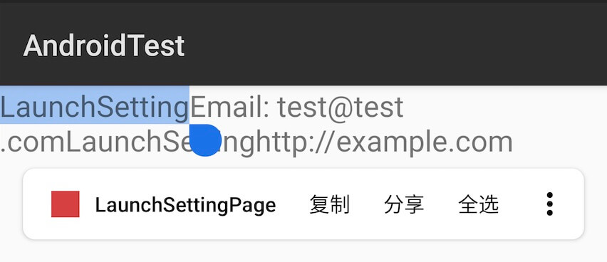
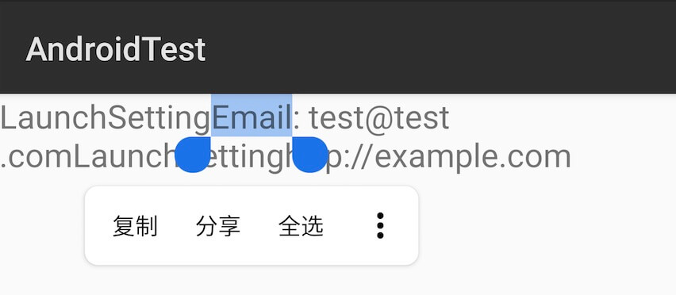
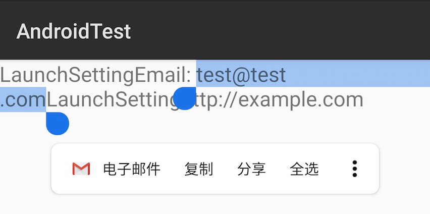
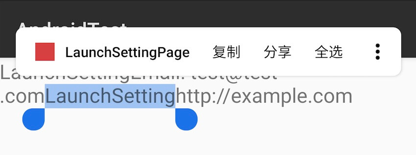
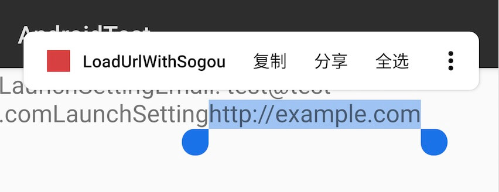

Android在API 26（Oreo）中引入了文本分类系统（Text classification system），在API 28（Pie）中进一步进行了完善。本文将对其简要介绍。

文本分类指的是系统能够识别特定类型的文本。例如邮件应用使用文本分类来确定接收的邮件是否为垃圾邮件。


图片来自：[https://developers.google.com/machine-learning/guides/text-classification/](https://developers.google.com/machine-learning/guides/text-classification/)

在Android中，常用的类型有电话号码，邮箱地址和超链接等，当识别到这些类型时，会分别触发调起拨号盘，邮件应用和浏览器操作。所有这些都是由系统默认的文本分类服务实现的。

可以通过如下方式得到系统的文本分类管理器：

```java
TextClassificationManager tcm = (TextClassificationManager) getSystemService(Context.TEXT_CLASSIFICATION_SERVICE);
```

我们可以手动执行文本分类，但需要注意的是系统默认的文本分类（`TextClassifier`）使用了机器学习模型，所以这是一个耗时操作。例如对一个邮件地址执行文本分类：

```java
TextClassificationManager tcm = (TextClassificationManager) getSystemService(Context.TEXT_CLASSIFICATION_SERVICE);
TextClassifier classifier = tcm.getTextClassifier();
String email = "test@test.com";
TextClassification emailClassification = classifier.classifyText(email, 0, email.length(), LocaleList.getDefault());
```

得到的TextClassification对象`emailClassification`形如：

```java
TextClassification {text=test@test.com, entities={email=1.0}, actions=[android.app.RemoteAction@6060295, android.app.RemoteAction@996afaa], id=androidtc|zh_v606|145573681}
```

我们还可以使用同一个`TextClassifier`对象执行其他的文本分类，例如一个超链接：

```java
String url = "http://example.com";
TextClassification urlClassification = classifier.classifyText(url, 0, url.length(), LocaleList.getDefault());
```

得到的TextClassification对象`urlClassification`形如：

```java
TextClassification {text=http://example.com, entities={url=1.0}, actions=[android.app.RemoteAction@5ea6738], id=androidtc|zh_v606|2042112308}
```

需要注意的是，当我们对文本执行`classifyText()`时，一定要精确的指定需要识别文本的`startIndex`和`endIndex`，否则将无法准确识别，例如对字符串`Email: test@test.com`进行识别，得到的结果为：

```java
TextClassification {text=Email: test@test.com, entities={address=2.925639E-6, other=0.999997}, actions=[], id=androidtc|zh_v606|2021406636}
```

可以看出并不能准确的识别出邮件地址。

那么我们如何才能准确的得到的`startIndex`和`endIndex`，这就要用到`TextClassifier`的`suggestSelection()`了，`suggestSelection()`能够在字符串中识别出一个可以分类为特定类型的子字符串。它的工作原理是这样的，当用户在`TextView`上长按时，初始的选择范围是一个单个字符，然后`TextClassifier`会逐渐扩大范围，直到识别到一个特定的类型。例如：

```java
String email = "Email: test@test.com";
TextSelection textSelection = classifier.suggestSelection(email, 10, 11, LocaleList.getDefault());
```

识别出的`textSelection`为：

```java
TextSelection {id=androidtc|zh_v606|2021415967, startIndex=7, endIndex=20, entities={email=1.0}}
```

可以看出，当startIndex为7，endIndex为20时，就是一个合法的邮件地址。

`TextClassifier`在Android中两处主要应用为`TextView`和`WebView`，例如我们很熟悉的在`TextView`上长按会弹出菜单，其中包含了“复制”、“全选”等选项，在Oreo及以上系统中，若成功的进行了识别，会在菜单的第一项添加一项。当点击此菜单项时，若是链接类型，就会调起浏览器。

下面将以一个具体的实例来说明文本分类的使用。

[MainActivity.java]

```java
package com.example.androidtest;

import android.app.Activity;
import android.content.Context;
import android.os.Bundle;
import android.view.textclassifier.TextClassificationManager;
import android.widget.TextView;

public class MainActivity extends Activity {
    @Override
    protected void onCreate(Bundle savedInstanceState) {
        super.onCreate(savedInstanceState);
        setContentView(R.layout.activity_main);

        TextClassificationManager tcm = (TextClassificationManager) getSystemService(Context.TEXT_CLASSIFICATION_SERVICE);
        ((TextView) findViewById(R.id.tv)).setTextClassifier(new MyTextClassifier(this, tcm.getTextClassifier()));
    }
}
```

[MyTextClassifier.java]

```java
package com.example.androidtest;

import android.app.PendingIntent;
import android.app.RemoteAction;
import android.content.Context;
import android.content.Intent;
import android.graphics.drawable.Icon;
import android.net.Uri;
import android.provider.Settings;
import android.view.textclassifier.TextClassification;
import android.view.textclassifier.TextClassifier;
import android.view.textclassifier.TextSelection;
import android.webkit.URLUtil;

import java.util.regex.Matcher;
import java.util.regex.Pattern;

public class MyTextClassifier implements TextClassifier {

    private Context mContext;
    private TextClassifier mDefaultTextClassifier;
    private Pattern mPattern;

    public MyTextClassifier(Context context, TextClassifier defaultTextClassifier) {
        mContext = context;
        mDefaultTextClassifier = defaultTextClassifier;
        mPattern = Pattern.compile("LaunchSetting");
    }

    @Override
    public TextSelection suggestSelection(TextSelection.Request request) {
        Matcher matcher = mPattern.matcher(request.getText().subSequence(request.getStartIndex(), request.getEndIndex()));
        if (matcher.find()) {
            // 字符串中可能有多处符合的"LaunchSetting"的处理
            return new TextSelection.Builder(request.getStartIndex() + matcher.start(), request.getStartIndex() + matcher.end())
                    .setEntityType(TextClassifier.TYPE_OTHER, 1f)
                    .build();
        } else {
            return mDefaultTextClassifier.suggestSelection(request);
        }
    }

    @Override
    public TextClassification classifyText(TextClassification.Request request) {
        String str = request.getText().subSequence(request.getStartIndex(), request.getEndIndex()).toString();
        Matcher matcher = mPattern.matcher(str);
        if (matcher.matches()) { // 当选择的文本匹配"LaunchSetting"时启动系统设置页面
            return new TextClassification.Builder()
                    .setText("LaunchSettingPage")
                    .setEntityType(TextClassifier.TYPE_OTHER, 1f)
                    .addAction(new RemoteAction(Icon.createWithResource(mContext, R.drawable.ic_test),
                            "LaunchSettingPage",
                            "launch system setting page",
                            PendingIntent.getActivity(mContext, 0, new Intent(Settings.ACTION_SETTINGS), 0))).build();
        } else if (URLUtil.isValidUrl(str)) { // 当是有效的URL时使用搜狗浏览器打开
            Intent intent = new Intent(Intent.ACTION_VIEW, Uri.parse(str));
            intent.setPackage("sogou.mobile.explorer");
            return new TextClassification.Builder()
                    .setText("LoadUrlWithSogou")
                    .setEntityType(TextClassifier.TYPE_URL, 1f)
                    .addAction(new RemoteAction(Icon.createWithResource(mContext, R.drawable.ic_test),
                            "LoadUrlWithSogou",
                            "load url with sogou browser",
                            PendingIntent.getActivity(mContext, 0, intent, 0))).build();
        } else {
            return mDefaultTextClassifier.classifyText(request);
        }
    }

}
```

[activity_main.xml]

```
<?xml version="1.0" encoding="utf-8"?>
<LinearLayout xmlns:android="http://schemas.android.com/apk/res/android"
    android:layout_width="match_parent"
    android:layout_height="match_parent"
    android:orientation="vertical">

    <TextView
        android:id="@+id/tv"
        android:layout_width="match_parent"
        android:layout_height="match_parent"
        android:text="LaunchSettingEmail: test@test.comLaunchSettinghttp://example.com"
        android:textIsSelectable="true"
        android:textSize="20sp" />
</LinearLayout>
```

运行应用后，在相应的位置长按效果如下图：











另外，上述自定义的`MyTextClassifier`在WebView上无法使用，在Pixel 2 XL（Android9）上运行时崩溃，在Nexus S（Android9）上运行时无法生效（即：在WebView上长按时菜单第一项无法展现为text classification），此问题涉及到WebView上长按展示菜单逻辑的相关代码。

具体代码位于“[src/content/public/android/java/src/org/chromium/content_public/browser/SelectionClient.java](https://cs.chromium.org/chromium/src/content/public/android/java/src/org/chromium/content_public/browser/SelectionClient.java?q=selectionclient&sq=package:chromium&g=0&l=1)”中`hasNamedAction()`判断，

```java
public boolean hasNamedAction() {
    return (label != null || icon != null) && (intent != null || onClickListener != null);
}
```

所以在实现`MyTextClassifier#classifyText`时返回的`TextClassification`实例需要有设置label，intent等属性。参考代码如下：

```java
Intent intent = new Intent(Intent.ACTION_VIEW, Uri.parse(str));
intent.setPackage("sogou.mobile.explorer");
return new TextClassification.Builder()
        .setText("LoadUrlWithSogou")
        .setLabel("UrlLabel")
        .setIcon(mContext.getDrawable(R.drawable.ic_test))
        .setIntent(intent)
        .setEntityType(TextClassifier.TYPE_URL, 1f)
        .addAction(new RemoteAction(Icon.createWithResource(mContext, R.drawable.ic_test),
                "LoadUrlWithSogou",
                "load url with sogou browser",
                PendingIntent.getActivity(mContext, 0, intent, 0))).build();
```

[参考](https://blog.stylingandroid.com/textclassification-part-3/)
