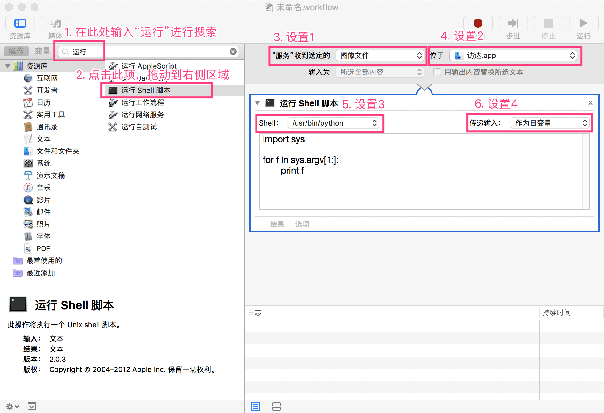
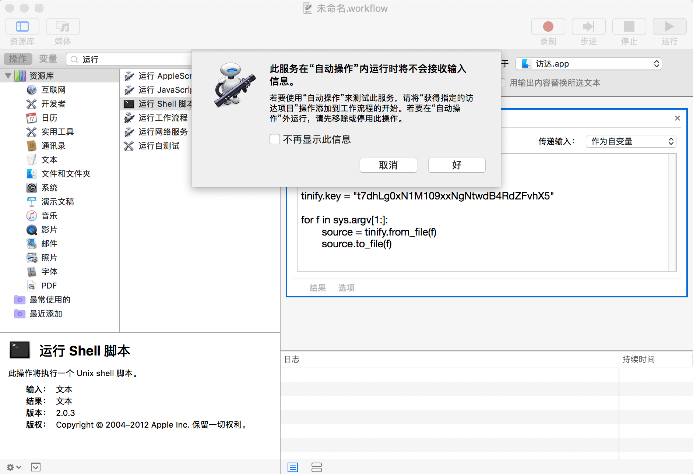
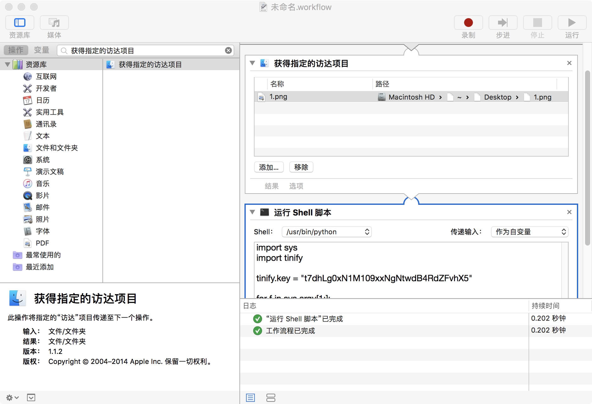

本文以使用 TinyPNG 压缩图片为例简要介绍 macOS 上的自动化工具 `automator`。

在日常工作中，我们经常会有压缩图片的需求，常用的方法就是使用在线的 TinyPNG 图片压缩服务，我们看看下面的操作步骤是不是很熟悉：

1. 启动浏览器，打开网址 [http://tinypng.com](http://tinypng.com)

1. 点击网页上的上传本地图片按钮，弹出文件选择弹窗，从文件选择弹窗中选择需要压缩的图片，例如 `1.png`

1. 等待压缩完成，点击网页上的下载按钮下载图片，下载后将得到压缩图片 `1-2.png`

1. 如果我们想要使用压缩后的图片替换原图片，那么需要将 `1.png` 删除，将 `1-2.png` 重命名为 `1.png`

整个过程操作起来简单不费事，但是作为一个追求效（B）率（格）的同学，是否还有更优雅的方法呢？这就引出了今天要介绍的 `automator`。

使用流程如下：

1. 点击 `Cmd`+`Space`，输入 `automator` 启动

1. 在菜单上依次选择 `文件`→`新建`，在弹出的 `选取文稿类型` 弹窗中选择 `服务`，然后点击 `选取` 按钮

1. 在搜索框中输入 `运行`，获取到搜索结果后点击 `运行 Shell 脚本`，将其拖入右侧窗口中，并进行如下设置
    1. `"服务"收到选定的` = `图像文件`
    1. `位于` = `访达`
    1. `Shell` = `/usr/bin/python`
    1. `传递输入` = `作为自变量`

经过上述流程操作后，结果如下图所示：



接下来进行API key的申请及相关脚本编写操作，具体步骤如下：

1. 到 TinyPNG 网站的 [DEVELOPER API页面](https://tinypng.com/developers) 上申请API key，例如我申请的一个key为 `t7dhLg0xN1M109xxNgNtwdB4RdZFvhX5`。
1. 打开 [API Reference页面](https://tinypng.com/developers/reference/python)，
    1. 按照页面上的说明安装依赖包
    1. 将页面上的API示例代码拷贝到 `automator` 的脚本编辑框中，完成后的脚本为：
```python
import sys
import tinify

tinify.key = "t7dhLg0xN1M109xxNgNtwdB4RdZFvhX5"

for f in sys.argv[1:]:
	source = tinify.from_file(f)
	source.to_file(f)
```

至此，脚本编写已完成，接下来开始运行脚本。
点击 `automator` 上的 `运行` 按钮，运行后弹出提示框，提示 `此服务在“自动操作”内运行时将不会接收输入信息。`，如下图所示：



原因是脚本此时运行没有输入参数（回忆上文 `"服务"收到选定的` 的设置为 `图像文件`，`位于` 的设置为 `访达`，即用户在 `访达` 中右键选中的图片是此脚本的输入参数，但目前在 `automator` 中运行时不可选择图片），为了脚本运行时有参数，我们按照提示弹窗中的信息将 `获得指定的访达项目` 添加到工作流程的开始，然后从 `访达` 中选择一个图片文件，操作后结果如下图所示：



再次点击 `运行` 按钮，等待运行完成，到 `访达` 中查看图片，发现图片压缩已完成。

至此，我们添加的自定义 `服务` 已完成，接下来将其保存到系统服务列表中，步骤如下：
1. 在面板中移除 `获得指定的访达项目`
1. 在菜单上依次选择 `文件`→`存储`，输入服务名称，例如 `TinyPNG`，点击“存储”按钮

那么我们自定义的服务如何运行呢？

1. 启动 `访达`，任意选择一张图片
1. 点击鼠标右键，依次选择 `服务`→`TinyPNG`，系统工具栏上会展示一个表示服务运行中的齿轮
1. 等待服务运行完成，观察到图片已完成了压缩

到现在是不是觉得图片压缩操作方便了许多呢，别急，还有一个问题，一张图片我们可以很方便的操作，如果现在我们要压缩100张图片呢？难道要处理完一张图片再处理另一张图片，那也够累的。细心的你可能已经注意到了上面脚本中的 `for f in sys.argv[1:]:`，这不就是批量操作吗？来试验一下吧，批量选择多张图片执行上述操作，发现成功对选择的多张图片进行了压缩。

这就完了吗？上面在压缩图片的时候你可能已经感觉到了，开始图片压缩操作后，我们就在那看着齿轮转啊转，不知道什么时候能压缩完成，这跟在麦当劳点餐后站在吧台等餐一样样的，在麦当劳我们还可以拿个叫号器，当听到它开始叫了，我们就知道餐好了。如此一想，我们也加个叫号器吧，当开始压缩图片后我们不再傻等，先愉快的去做别的事情，等听到叫声，我们就知道压缩完成了。

修改完成的脚本如下：

```python
import sys
import tinify
import subprocess

tinify.key = "t7dhLg0xN1M109xxNgNtwdB4RdZFvhX5"

for f in sys.argv[1:]:
	source = tinify.from_file(f)
	source.to_file(f)

subprocess.Popen("afplay /System/Library/Sounds/Glass.aiff".split())
```

故事还没完，突然有一天，我们不再需要压缩图片了。本着不需要就丢掉的极简主义思想，上面我们创建的 `TinyPNG` 服务应该被删除。因为此服务是添加在 `访达` 中的，所以启动 `访达`，依次选择 `访达`→`服务`→`服务偏好设置...`，在列表中找到 `TinyPNG`，点击右键选择 `在访达中显示`，打开访达后，将 `TinyPNG.workflow` 删除即可。

> 后记：本来想以一个小故事的形式呈现，比如压缩图片最开始是手动操作，然后由于经常操作很繁琐，想到是否可以自动化操作，在网上搜索后发现有使用Alfred的方案，但Alfred收费，接着寻找免费方案，这样将整个心路历程写下来问题的解决及方案的选择等会显得更加自然。