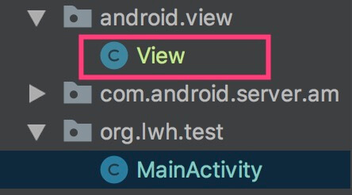

> 说明：近期准备写一篇博客，会用到安卓源码调试的相关内容，所以将以前写过的一篇源码调试的文章贴到博客中，对源码调试不熟悉的同学可作为参考。

* [准备工作](#准备工作)
* [应用进程源码调试](#应用进程源码调试)
* [系统进程源码调试](#系统进程源码调试)
* [native源码调试](#native源码调试)
* [附件](#附件)

### 准备工作
1. 编译 Android 5.1（API 22）的安卓源码（源码地址为：https://github.com/aosp-mirror/platform_frameworks_base/tree/lollipop-mr1-release ），编译后获取我们要用的 `system.img` 和 `libart.so`

1. 下载编译好的 `system.img` 文件到本地（可直接使用我编译的包，见 [附件1](#附件1)）

1. 创建安卓模拟器，配置如下：
Target：`Android 5.1`
CPU/ABI：`arm`

1. 进入模拟器文件目录，如 `/Users/apple/.android/avd/Nexus_S_API_22.avd`，将 `system.img` 文件拷贝到此目录中

1. 启动模拟器

1. 创建安卓测试工程，在界面上添加一个 `Button`，为 `Button` 添加点击事件，内容如下：

```java
findViewById(R.id.btn).setOnClickListener(new View.OnClickListener() {
    @Override
    public void onClick(View v) {
        Log.e("zzz", "btn clicked");
    }
});
```
运行测试工程

### 应用进程源码调试

此示例演示如何调试应用进程中的 framework 源码，以按钮点击事件为例。通过查看源码可知，当按钮点击事件发生时将执行到 `android.view.View#performClick()`，到 `准备工作` 小节 `步骤1` 中的地址下载 `android.view.View.java` 源码（源码见 [附件2：View.java](#附件2)），然后按照与系统源码相同的路径将其导入到我们的测试工程中，导入后的项目结构如下：



在 `View#performClick()` 代码处打上断点，将测试工程进程attach到调试器上，点击按钮，即可开始调试，如下：


### 系统进程源码调试

此示例演示如何调试系统进程中的源码，以 ANR 事件为例。通过阅读源码可知，当 ANR 时将执行到 `com.android.server.am.ActivityManagerService#appNotResponding()`，到 `准备工作` 小节 `步骤1` 中的地址下载 `com.android.server.am.ActivityManagerService.java` 源码（源码见 [附件3：ActivityManagerService.java](#附件3)），然后按照与系统源码相同的路径将其导入到我们的测试工程中，导入后的项目结构如下：


在应用中添加执行耗时代码，如点击按钮后执行如下代码：

```java
findViewById(R.id.btn).setOnClickListener(new View.OnClickListener() {
    @Override
    public void onClick(View v) {
        try {
            Thread.sleep(Long.MAX_VALUE);
        } catch (Throwable t) {
        }
    }
});
```

运行测试工程，打开进程attach窗口，将 `system_process` 进程attach到调试器上，如下：

> 注意正确attach代码运行时所在的进程


点击按钮，等待 ANR 回调。回调完成，如下图所示：


> 小Tip：在上面的两个示例中，如果 View.java 和 ActivityManagerService.java 在测试工程运行前就添加到工程中的话，会因为其中的类依赖无法解决导致测试工程无法启动，可以先将文件重命名，如 View.java重命名为 View.java2，待测试工程运行起来后再改回为 View.java，此时保证能找到正确类文件即可。

### native源码调试

此示例演示如何调试 native 源码，以 GC 事件为例。在测试工程中添加如下代码触发 GC：

```java
findViewById(R.id.btn).setOnClickListener(new View.OnClickListener() {
    @Override
    public void onClick(View v) {
        Runtime.getRuntime().gc();
    }
});
```

运行测试工程，选择 native 调试功能。具体步骤如下
* 点击 "Run" 按钮左边的下拉框，如下图：


选择 "Edit Configuration"，在弹出的 "Run/Debug Configurations" 窗口中，在 "Debugger" 标签页下选择 "Debug type" 为 "native"，如下图：


* 点击 "Debug" 按钮运行调试程序


运行程序之后，在  AndroidStudio 中打开 "Debug" 窗口，点击 "Pause Program" 按钮，状态如下：


然后切换到 "lldb" 命令行窗口中输入 `br s -n CollectGarbageInternal` 后执行，状态如下：


上述命令执行后，可以看到输出了如下信息：

```
Breakpoint 2: where = libart.so`art::gc::Heap::CollectGarbageInternal(art::gc::collector::GcType, art::gc::GcCause, bool), address = 0xb4648c20
```

可以看到，断点已经成功设置；这个断点在 `libart.so` 中，不过现在还没有调试符号信息以及源码信息，我们只知道它的地址。接下来我们设置调试符号以及关联源码。

* 关联源码

下载编译好的 `libart.so` (可直接使用我编译的包，见 [附件1](#附件1)) 文件到本地，然后将刚才下载到本地的符号文件 `libart.so` 告诉调试器，在 "LLDB" 窗口中执行：

```
add-dsym /Users/apple/Documents/aosp/images/51/libart.so
```

> 此处 libart.so 文件放置在 /Users/apple/Documents/aosp/images/51/ 目录下

命令执行完成后提示符号文件已经被正确添加，如下图：


查看上述步骤中我们执行 `br s -n CollectGarbageInternal` 后的输出信息，信息中有 `Breakpoint 2` 字样，表示我们刚添加的断点号为 `2`，在 LLDB 窗口中执行如下命令：

```
br list 2
```

输出信息如下：

```
2: name = 'CollectGarbageInternal', locations = 1, resolved = 1, hit count = 0
  2.1: where = libart.so`art::gc::Heap::CollectGarbageInternal(art::gc::collector::GcType, art::gc::GcCause, bool) at heap.cc:2124, address = 0xb4648c20, resolved, hit count = 0
```

与上述步骤中添加断点时输出的信息对比，可以看到行号信息已经加载出来了，在 "heap.cc" 文件的第2124行。

* 命中断点

此时点击测试工程中的按钮，断点将会命中，调试器状态如下：


* 关联源码

按照上述步骤操作后，还未关联到 native 源码，在 LLDB 窗口中输入 `source info` 查看调试器所所知道的源码信息，如下：

```
Lines found in module `libart.so
[0xb4648c20-0xb4648c28): /search/android/android51/art/runtime/gc/heap.cc:2124
```

在 LLDB 中输入如下命令关联源码：

```
settings set target.source-map /search/android/android51/art /Users/apple/Documents/android51/art
```

> 注：/search/android/android51/art 为源码编译时的 ART 虚拟机源码目录，/Users/apple/Documents/android51/art 为下载到本地的 ART 源码目录

* 再次命中断点

此时我们再触发断点（执行 `Runtime.getRuntime().gc();`），可以看到程序在 "CollectGarbageInternal" 处断住了。此时就可以 native 源码调试了，如下图：


### 附件

#### 附件1

`system.img` 和 `libart.so`，文件分享链接为：https://share.weiyun.com/5S4jgoa ，访问密码为：`ks3r6t`

#### 附件2

[View.java](./file/android_source_debug_guide/View.java.zip)

#### 附件3

[ActivityManagerService.java](./file/android_source_debug_guide/ActivityManagerService.java.zip)